Ce guide détaille l'utilisation et la gestion des canaux dans kChat : création, conversion, archivage, catégories et favoris.

## Canal Général

Chaque Organisation sur kChat possède automatiquement un canal **Général** dans lequel tous les utilisateurs sont automatiquement invités :

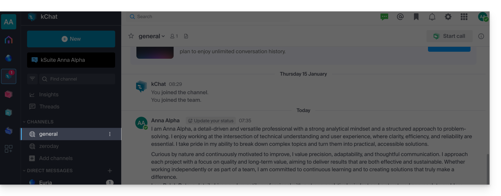

Utilisez ce canal pour partager des informations qui concernent toute votre organisation, comme les sorties d'entreprise ou des bonnes nouvelles motivantes.

## Créer un canal

1. Cliquez sur le bouton **Nouveau** dans la barre latérale gauche.
2. Cliquez sur **Créer un nouveau canal**.
3. Vous pouvez également cliquer sur **Ajouter des canaux** en dessous de la liste des canaux :

    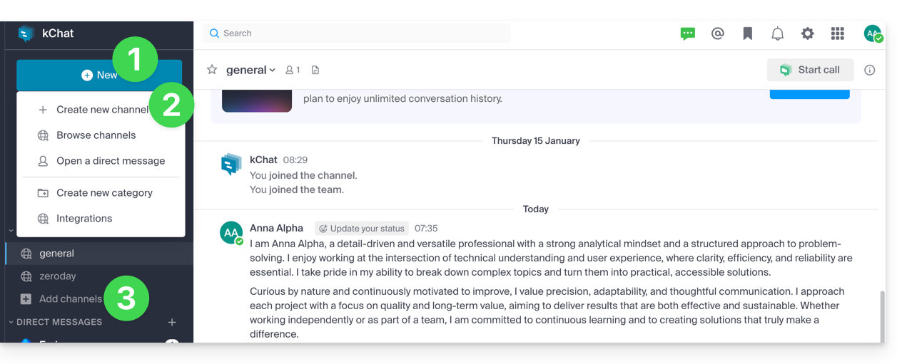

### Informations relatives à un canal

Lors de la création, vous pouvez définir :

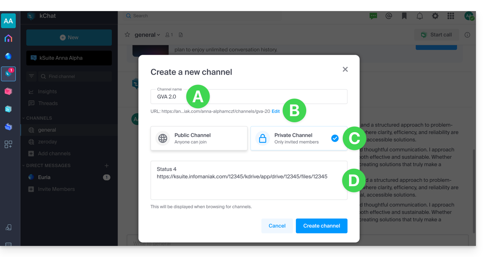

| Champ | Description |
|---|---|
| **A. Nom** | Modifiable par la suite. |
| **B. URL** | Par défaut reprend le nom du canal. Lettres minuscules, nombres, points, tirets, underscores. Modifiable. |
| **C. Statut** | **Privé** ou **Public** — modifiable par la suite. |
| **D. Description** | Précise l'usage du canal. Apparait dans la liste des canaux du menu « Plus... ». |

Une fois le canal créé, vous pouvez encore définir un **en-tête** (E) et consulter les **informations** (F) :

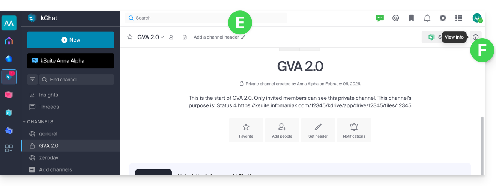

Cliquez sur **Informations** pour éditer certains champs :

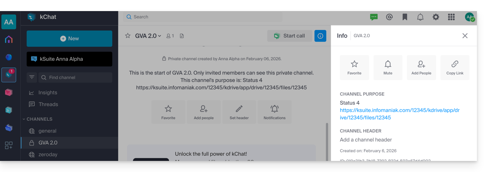

## Canaux publics vs privés

| Type | Avantage |
|---|---|
| **Public** | Transparence : tous les utilisateurs peuvent voir et rejoindre le canal. |
| **Privé** | Restreint le contenu sensible aux utilisateurs de votre choix. Seul un membre existant peut inviter un autre utilisateur. |

:::note[Limits selon l'offre]
| Offre | Canaux privés | Canaux publics |
|---|---|---|
| kSuite gratuit | 5 | 10 |
| Standard | 50 | 50 |
| Business | 100 | 100 |
| Enterprise | 1000 | 1000 |

L'historique conservé est de 90 jours (supprimé après 365) en gratuit, illimité pour les autres offres.
:::

## Convertir un canal

:::caution[Prérequis]
Être **administrateur kChat**. Être administrateur de l'Organisation ou administrateur du canal ne suffit pas.
:::

### Public → Privé

1. Cliquez sur le chevron sur le titre du canal **Public**.
2. Cliquez sur les **paramètres** du canal.
3. Choisissez **Convertir** :

    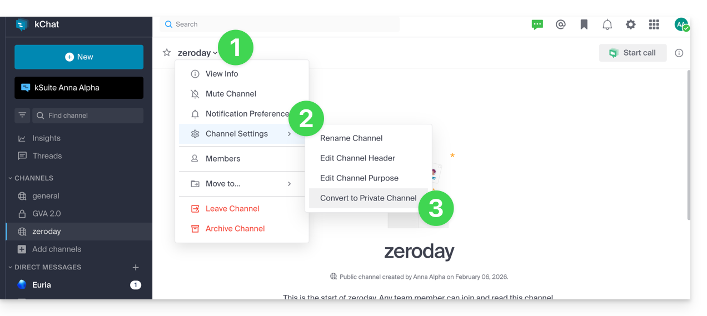

:::note
Le verrouillage est permanent : les fichiers partagés publiquement restent accessibles à toute personne disposant du lien.
:::

### Privé → Public

1. Cliquez sur le chevron sur le titre du canal **Privé**.
2. Cliquez sur les **paramètres** du canal.
3. Choisissez **Convertir** :

    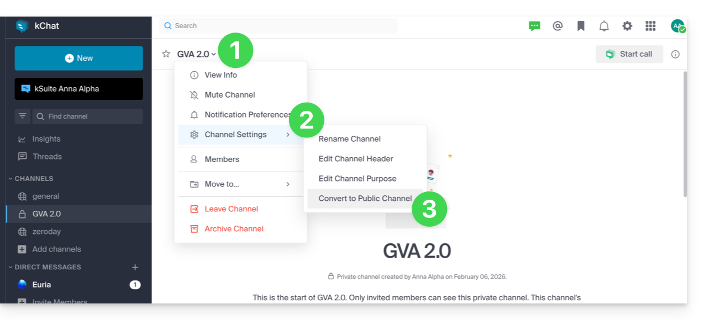

Vous pouvez également effectuer la conversion depuis le **Manager** Infomaniak :

1. Accédez à la [gestion de kChat](https://manager.infomaniak.com/v3/ng/kchat/) sur le Manager.
2. Affichez les canaux privés via le menu déroulant.
3. Cliquez sur le menu d'action **⋮** à droite du canal concerné.
4. Cliquez sur **Convertir en canal public** :

    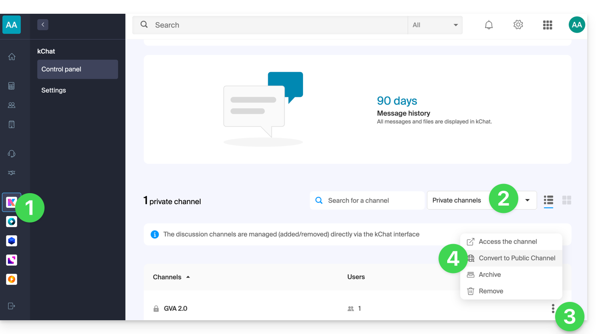

## Quitter un canal

Mis à part le canal **Général**, vous pouvez quitter un canal à tout moment :

1. Cliquez sur le chevron sur le titre du canal.
2. Cliquez sur **Quitter le canal** :

    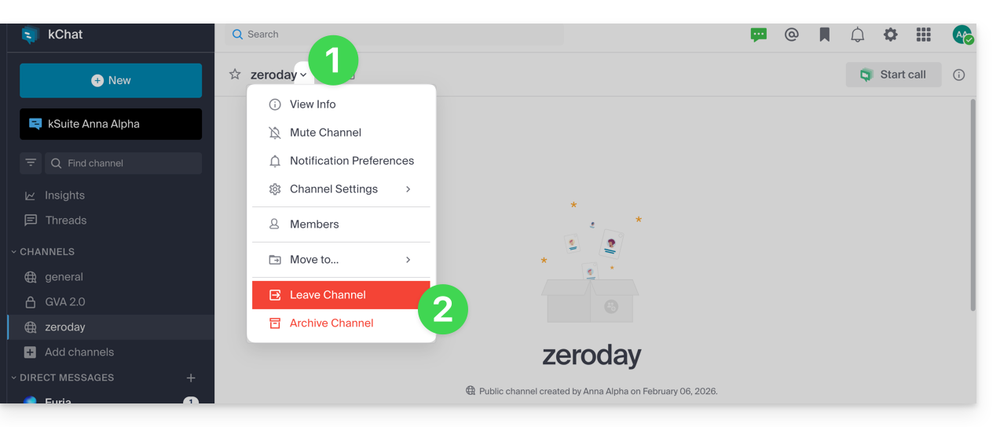

:::tip
- Si vous quittez un canal **privé**, vous ne le retrouverez plus que via son URL ou en étant réinvité.
- Si vous quittez un canal **public**, vous pouvez le rejoindre quand vous le souhaitez via la recherche :

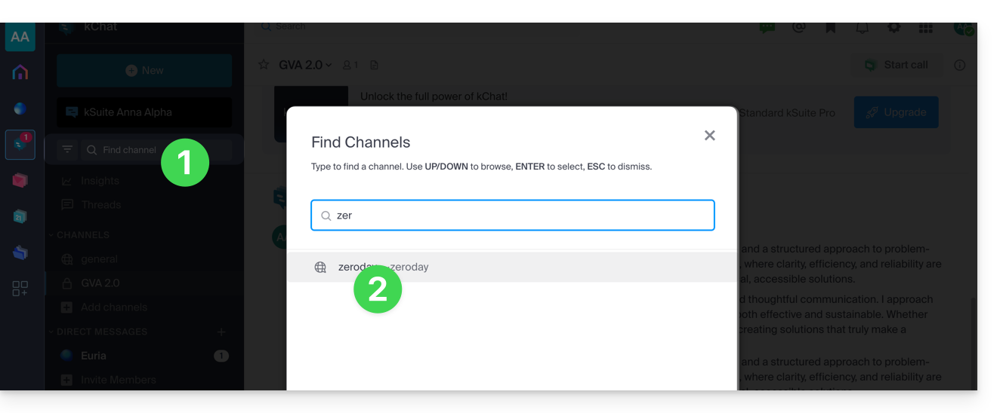
:::

## Archiver / supprimer un canal

### Archiver

L'archivage empêche tout nouveau message et le canal ne compte plus dans votre quota. L'opération est faisable depuis le [Manager](https://manager.infomaniak.com/v3/ng/kchat/) ou directement sur l'interface kChat :

1. Cliquez sur le chevron sur le titre du canal.
2. Cliquez sur **Archiver le canal** :

    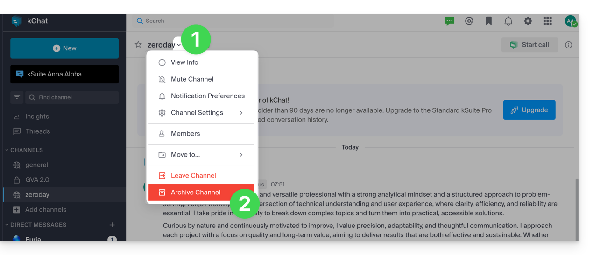

Un canal archivé peut être rejoint en le retrouvant avec son nom dans la recherche :

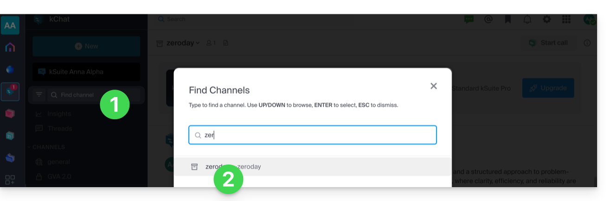

### Désarchiver

1. Cliquez sur le chevron sur le titre du canal archivé.
2. Cliquez sur **Désarchiver le canal** :

    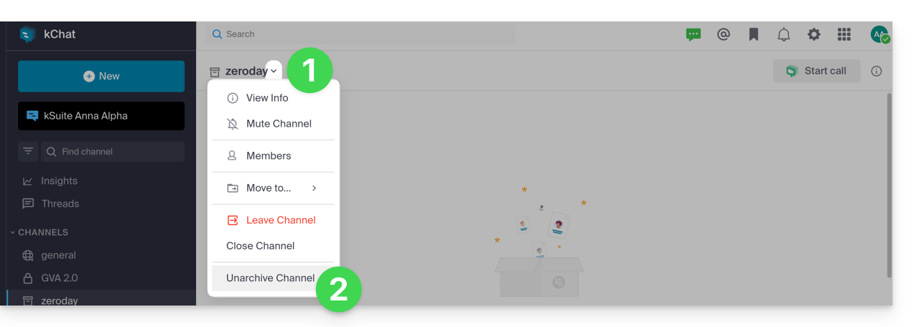

… ou le clore pour ne plus le voir sur votre interface :

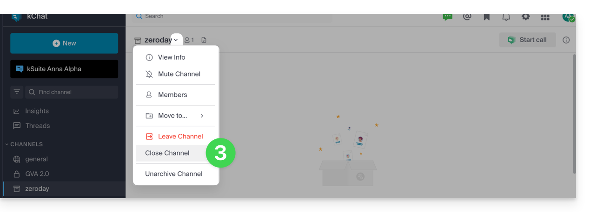

### Supprimer

La suppression efface définitivement toutes les données associées :

1. Accédez à la [gestion de kChat](https://manager.infomaniak.com/v3/ng/kchat/) sur le Manager.
2. Cliquez sur le menu d'action **⋮** à droite du canal concerné.
3. Cliquez sur **Supprimer** :

    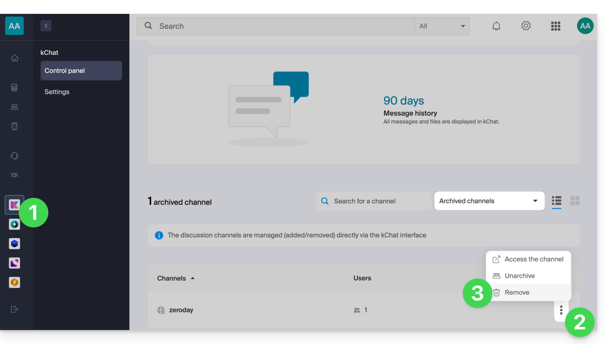

## Mettre un canal en favori

1. Cliquez sur l'icône **étoile** située en haut d'un canal ou d'un utilisateur.
2. Un nouveau menu **Favoris** apparaitra dans la barre latérale gauche regroupant tous les éléments favoris (visible pour votre utilisateur uniquement) :

    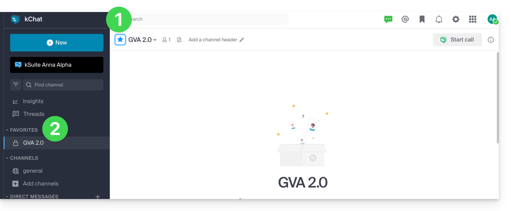

## Mettre un canal en sourdine

Pour masquer les [notifications](../notifications/) d'un canal :

1. Cliquez sur le menu d'action **⋮** à droite du canal concerné.
2. Choisissez **Sourdine** :

    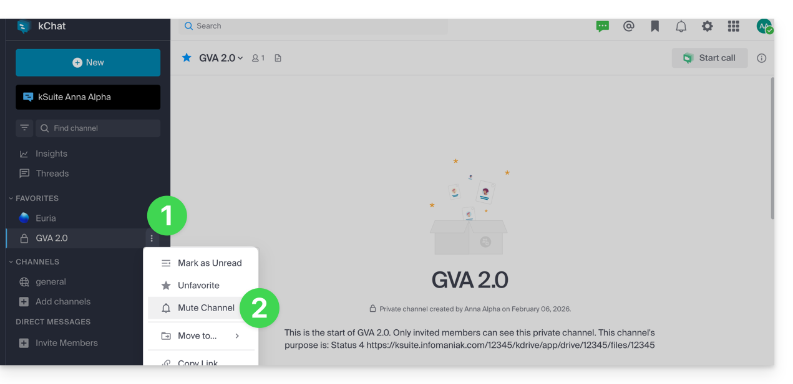

## Organiser par catégories

:::note[Limits selon l'offre]
| Offre | Catégories max. (par utilisateur) |
|---|---|
| kSuite gratuit | 1 (hors Favoris) |
| Standard / Business / Enterprise | Illimité |
:::

1. Cliquez sur le bouton **Nouveau** dans la barre latérale gauche.
2. Cliquez sur **Créer une nouvelle catégorie** :

    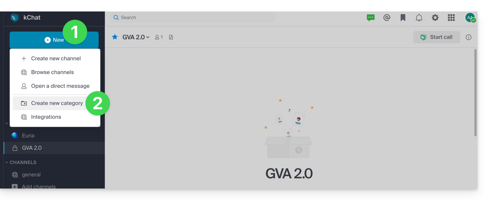

3. Glissez le canal désiré sur la catégorie créée (valable pour votre utilisateur uniquement) :

    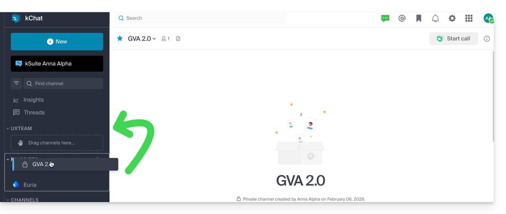

4. Vous pouvez également utiliser le menu d'action **⋮** à droite du canal :

    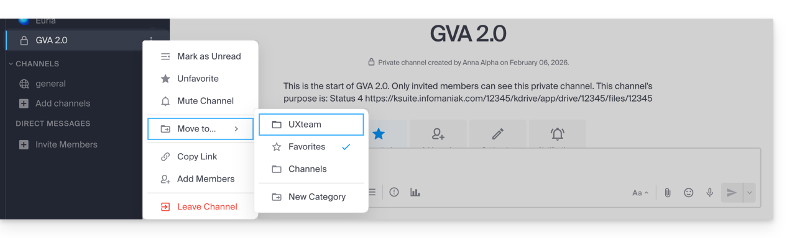

## Messages personnels

Les messages personnels sont des conversations directes entre deux ou plusieurs personnes en dehors des canaux. Chaque utilisateur peut librement créer des messages personnels dont le contenu sera uniquement visible par les personnes concernées :

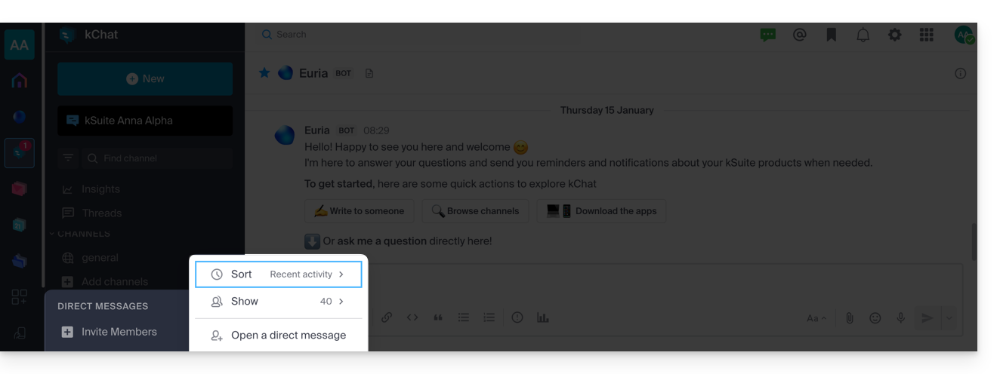

---

## Sources

- [Gérer un canal kChat — FAQ 2732](https://faq.infomaniak.com/2732)
- [Gérer les conversations kChat — FAQ 1758](https://faq.infomaniak.com/1758)
