Ce guide détaille l'envoi de messages, le formatage, les mentions, les fils de discussion et les fonctionnalités avancées des conversations kChat.

## Commencer une conversation

Pour écrire à un utilisateur de votre Organisation, cliquez sur son nom dans la liste des membres à gauche de l'interface :

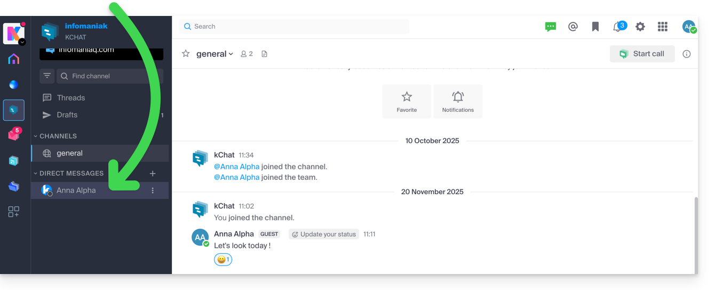

Vous pouvez également cliquer sur le **+** à droite des **Messages personnels** pour sélectionner jusqu'à 7 membres et créer une conversation de groupe :

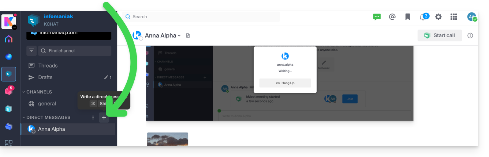

Rédigez et envoyez votre message en appuyant sur le bouton d'envoi :

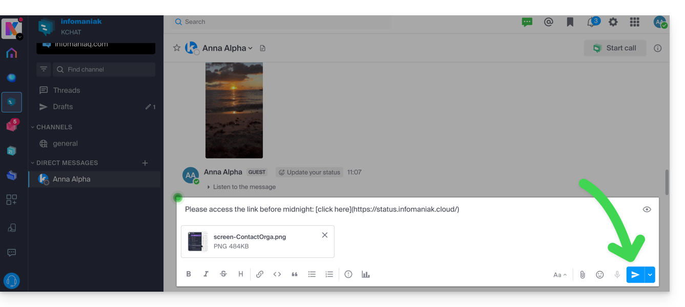

:::tip
Vous pouvez joindre des fichiers jusqu'à 100 Mo et utiliser des [réactions](#réagir-à-un-message) (émojis, GIF).
:::

## Formater le texte (Markdown)

Voici les symboles à ajouter avant et après votre texte pour le formater :

| Symboles | Résultat | Exemple |
|---|---|---|
| `*` | *italic* | `*Ceci sera en italic*` |
| `**` | **gras** | `**Ceci sera en gras**` |
| `***` | ***italic+gras*** | `***Ceci sera en italic+gras***` |
| `~~` | ~~barré~~ | `~~Ceci sera barré~~` |
| ` ``` ` | `ligne de code` | ` ```Ceci est du code``` ` |
| `***` (seul sur une ligne) | --- (séparateur) | `1ère partie` / `***` / `2ème partie` |

## Insérer une image

### À partir d'une presse-papier (URL)

Si l'URL vers l'image est en mémoire dans le presse-papier, il suffit de coller le lien dans une conversation et l'image sera ajoutée à votre message.

Vous pouvez aussi utiliser la syntaxe Markdown :

```

```

### À partir du disque dur ou de kDrive

Cliquez sur l'icône du trombone pour insérer une image existante sur votre disque dur ou sur kDrive :

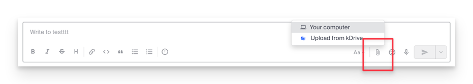

L'image sera insérée dans le message et envoyée directement dans la conversation sans obligatoirement ajouter de texte supplémentaire.

## Mentionner un autre utilisateur

Pour solliciter l'un des membres de l'Organisation (ou tout un [groupe](../membres/)), tapez l'arobase `@` pour afficher les personnes ou les canaux à mentionner :

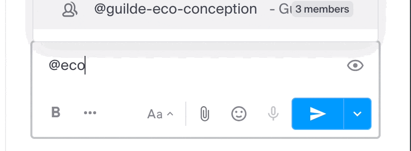

:::caution
Selon le type de canal concerné, la mention d'un utilisateur peut afficher un message vous permettant de l'ajouter à la discussion (ou de le notifier). Sans cette action, il ne verra pas la mention.
:::

## Demander un accusé de lecture

Activez un accusé de lecture avant l'envoi du message en cliquant sur l'icône `(!)` puis en activant le bouton à bascule :

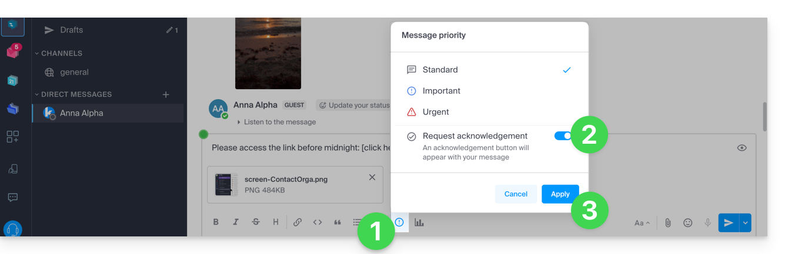

Une fois le message envoyé, le résultat sera le suivant :

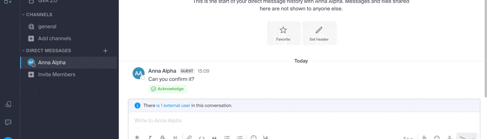

## Envoyer un message différé (planifié)

:::caution[Disponibilité]
L'envoi différé n'est pas disponible avec **my kSuite** / **my kSuite+** (ik.me, etik.com, ikmail.com). **kSuite gratuit** ne permet pas la personnalisation de l'horaire lors de la planification.
:::

Pour programmer un envoi à une date/heure ultérieure, cliquez sur le chevron à droite du bouton d'envoi puis choisissez le moment où le message devra être envoyé :

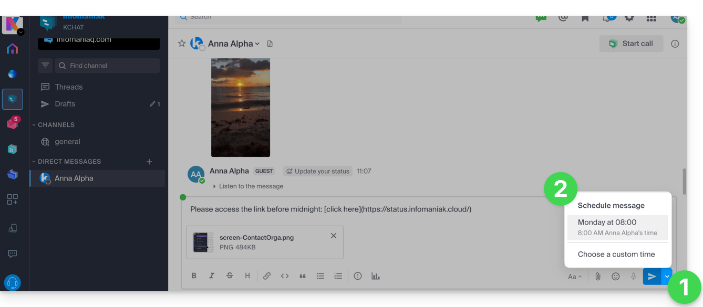

:::tip[Sur mobile]
Sur l'app mobile kChat, appuyez **quelques secondes** sur le bouton d'envoi pour afficher le menu de planification.
:::

## Éditer, supprimer ou épingler un message

Pour **éditer** un message (qui comportera alors une mention de message édité), cliquez sur le menu d'action à droite du message. Au même endroit, vous pouvez **supprimer** votre message qui disparaitra alors de la discussion chez tous les utilisateurs :

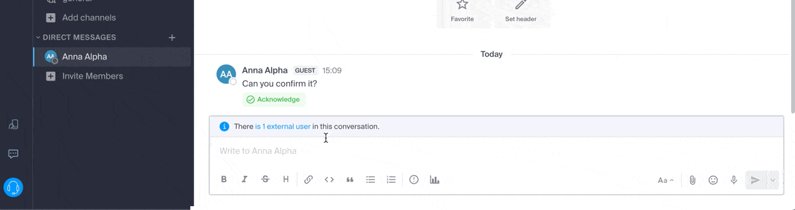

:::note
Une indication concernant la suppression apparaitra chez tous les autres utilisateurs du canal à l'emplacement initial du message.
:::

Vous pouvez également **épingler** un message :

- Les messages épinglés sont visibles par tous les membres du canal, qu'il soit public ou privé.
- Les messages épinglés dans un canal privé ne sont accessibles qu'aux membres de ce canal.
- Consultez la liste de tous les messages épinglés via l'option « Messages épinglés » du canal.
- Pour retirer un message épinglé, survolez-le à nouveau et sélectionnez « Désépingler ».

## Fil de discussion (thread)

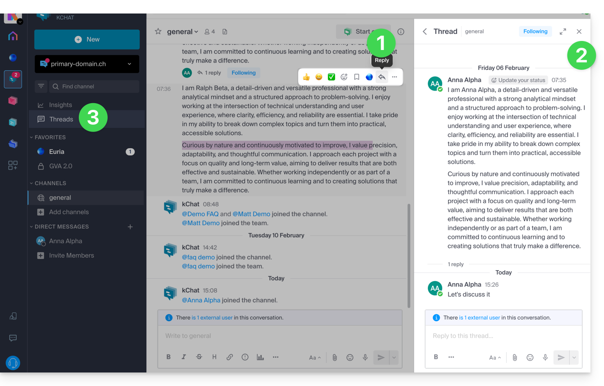

1. Quel que soit le canal ou le chat privé avec un autre utilisateur, vous pouvez démarrer un fil de discussion à partir d'un message en choisissant **Répondre** sur le message désiré.
2. Un fil de discussion s'ouvre dans un volet latéral droit, permettant à chaque utilisateur du canal d'apporter ses propos dans ce fil spécifique sans perturber les nouveaux sujets du canal en cours. Ce fil peut être **suivi** ou **ignoré** afin de ne plus recevoir de notification lors de nouveau message.
3. Ces fils de discussion sont centralisés pour être lus et relus dans la partie **Fils de discussion** de la barre latérale gauche.

## Réagir à un message

Pour réagir à un message, survolez-le et sélectionnez l'émoticône parmi la sélection ou le smiley avec le petit **+** :

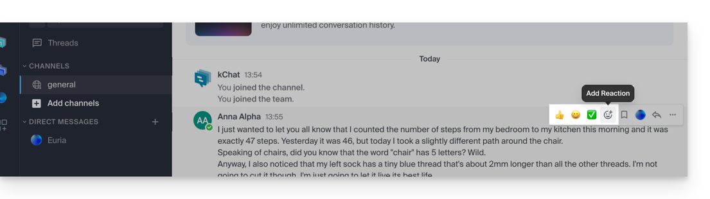

S'il y a déjà des réactions affichées en dessous des messages, vous pouvez en ajouter une au même endroit :

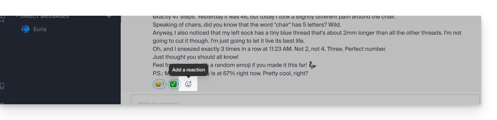

Le panneau propose des centaines d'émoticônes, des GIF animés et des émojis personnalisés.

### S'exprimer avec une émoticône ou un GIF

Cliquez sur l'icône du visage souriant dans la barre de formatage de votre message :

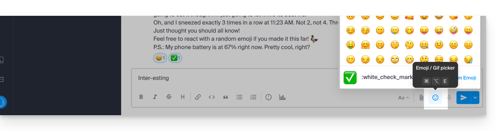

Vous pouvez choisir un émoji ou insérer des courts GIF animés grâce à l'onglet situé en haut de l'encart :

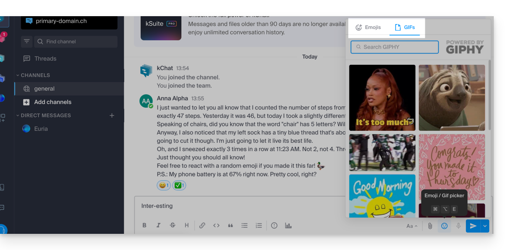

Si vous connaissez le nom du symbole, tapez `:` (deux points) suivi des 2 premiers caractères au minimum :

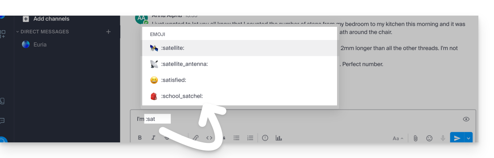

### Émoticônes personnalisées

Pour gérer des émoticônes supplémentaires, cliquez sur le bouton dédié du panneau des émojis :

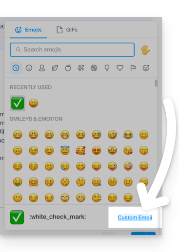

- Nom jusqu'à 64 caractères (letttres minuscules, chiffres, `-`, `+`, `_`).
- Fichier `.gif`, `.png` ou `.jpg` jusqu'à 1 Mo, redimensionné à 128×128 pixels.
- L'émoticône sera utilisée par tous les utilisateurs kChat de votre Organisation :

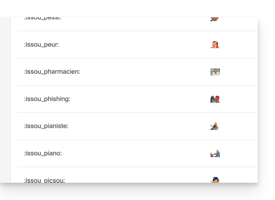

## Messages vocaux

### Enregistrer un message vocal

1. Cliquez sur l'icône du micro depuis la fenêtre de rédaction d'un nouveau message :

    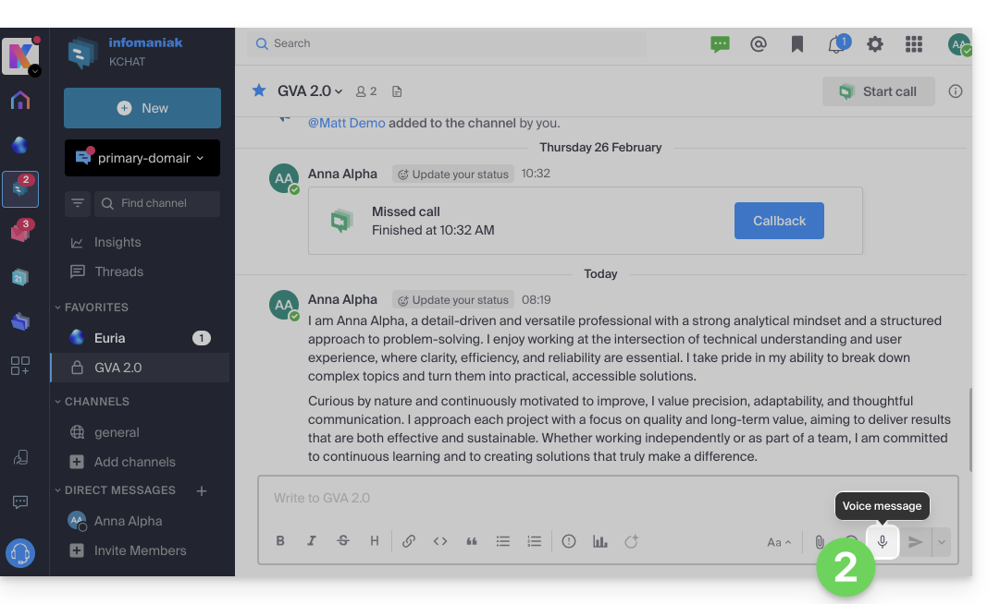

2. Des permissions sont demandées par le système pour accéder à votre interface vocale et sonore :

    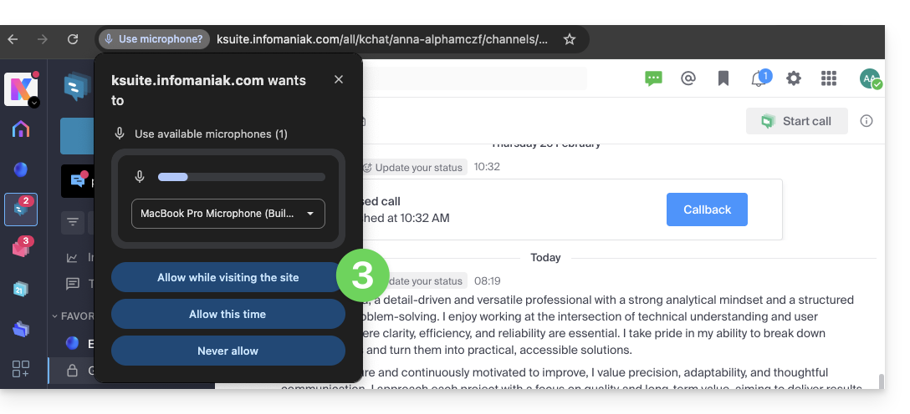

3. Une fois le message en cours d'enregistrement, cliquez sur la croix pour l'effacer ou sur l'icône **✓** pour le conserver :

    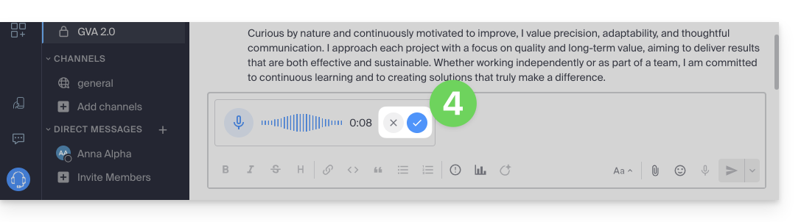

4. Une fois conservé, le message n'est pas envoyé directement mais ajouté dans un nouveau message. Vous pouvez le réécouter, l'effacer ou changer l'importance de l'envoi :

    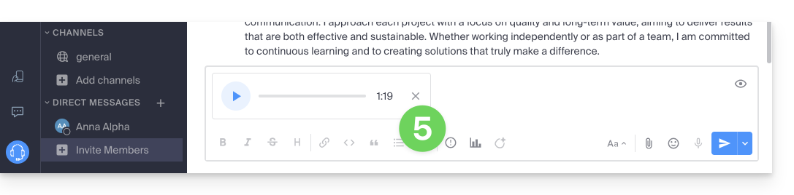

5. Une fois envoyé, il apparait dans la discussion avec son texte transcrit en toutes lettres :

    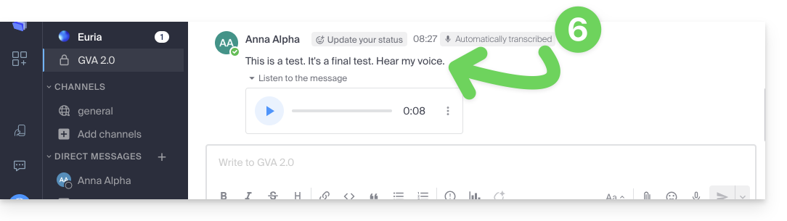

### Écouter et télécharger

- Cliquez sur le bouton **▶** (Play) pour démarrer l'écoute, recliquez pour mettre en pause.
- Pour télécharger le message vocal, cliquez sur le menu d'action **⋮** puis lancez le téléchargement :

    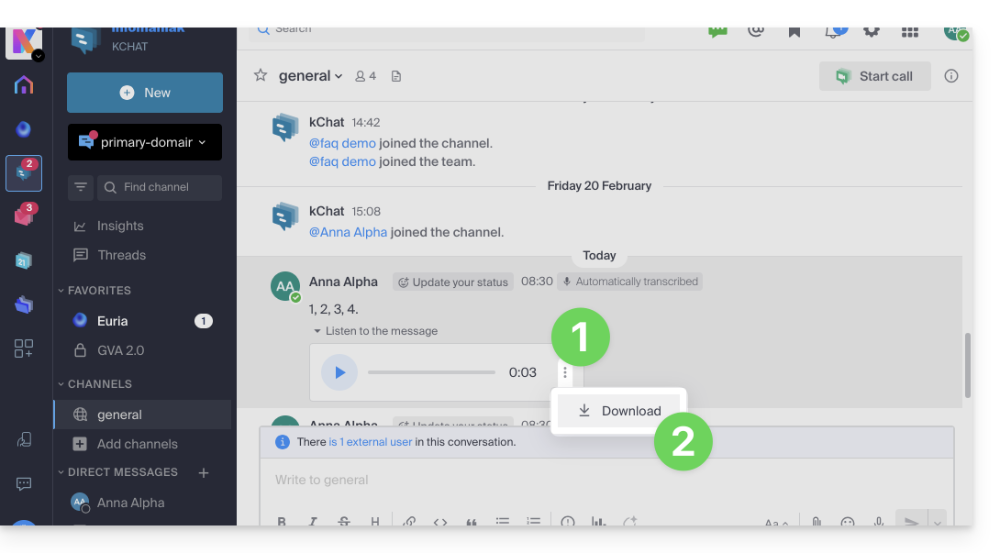

## Créer un rappel de message

:::caution[Disponibilité]
Les rappels personnalisés ne sont pas disponibles avec **my kSuite** / **my kSuite+**. **kSuite gratuit** ne permet pas la personnalisation de l'horaire.
:::

Pour revoir un message grâce à une notification dans le futur :

1. Survolez le message à rappeler et sélectionnez l'icône des actions supplémentaires **•••**.
2. Cliquez sur **Rappel**.
3. Choisissez le moment souhaité pour être notifié :

    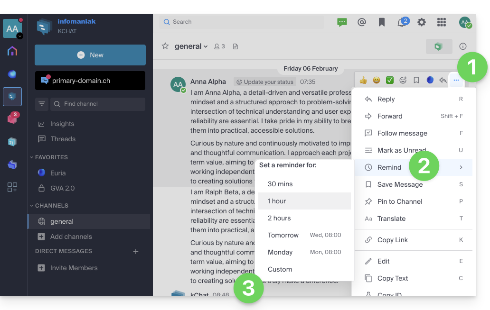

4. Une notification dans le canal (visible uniquement par vous) indique le prochain rappel :

    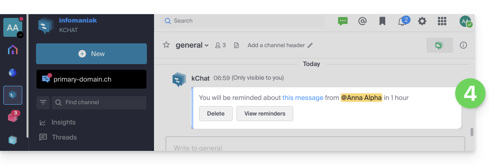

Vous recevrez le moment choisi une notification du canal Euria dans le menu latéral gauche, conduisant vers le rappel contenant une citation du message.

## Organiser les conversations

Le type de tri pour les éléments de la barre latérale gauche est très important :

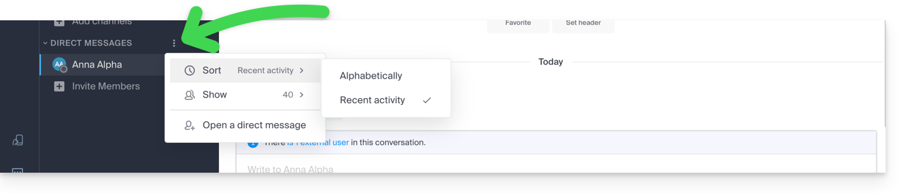

Le choix du type de tri est disponible pour tous les éléments : canaux de discussions, catégories, messages directs, etc. :

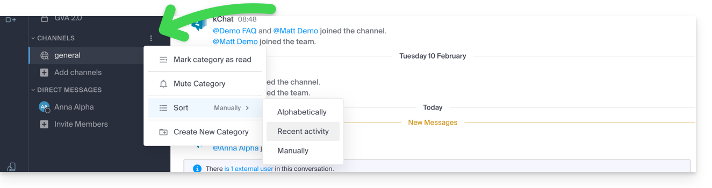

## Rechercher une conversation

La recherche d'éléments (mot, participant, fichier) se trouve en haut de la fenêtre. Une fois des résultats trouvés, ils apparaissent sur la droite :

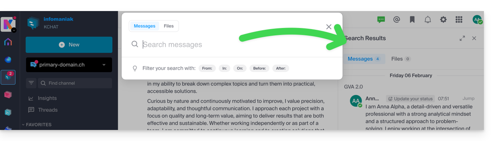

---

## Sources

- [Gérer les conversations kChat — FAQ 1758](https://faq.infomaniak.com/1758)
- [Mettre en forme texte & image sur kChat — FAQ 1407](https://faq.infomaniak.com/1407)
- [Gérer les émoticônes et gif sur kChat — FAQ 1190](https://faq.infomaniak.com/1190)
- [Gérer les messages vocaux avec kChat — FAQ 2876](https://faq.infomaniak.com/2876)
- [Créer un rappel de message kChat — FAQ 1664](https://faq.infomaniak.com/1664)
- [Traduire le contenu d'un message sur kChat — FAQ 1467](https://faq.infomaniak.com/1467)
