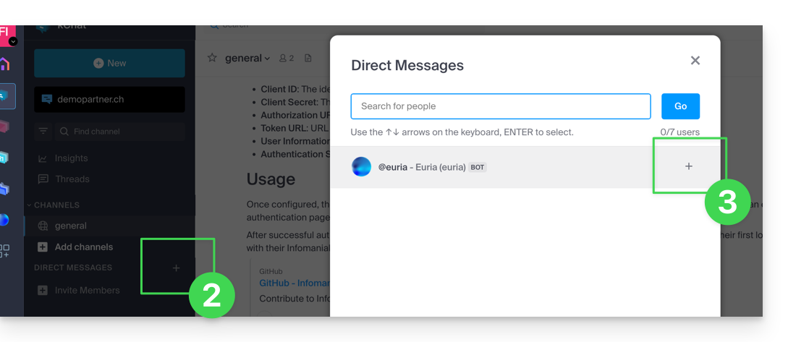
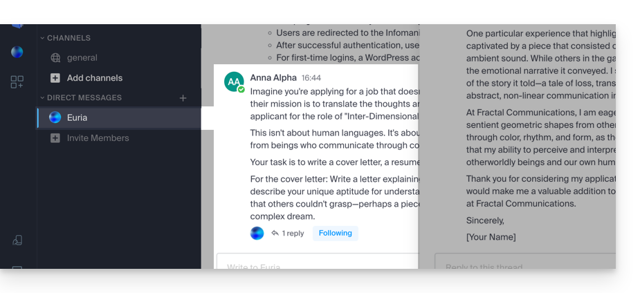
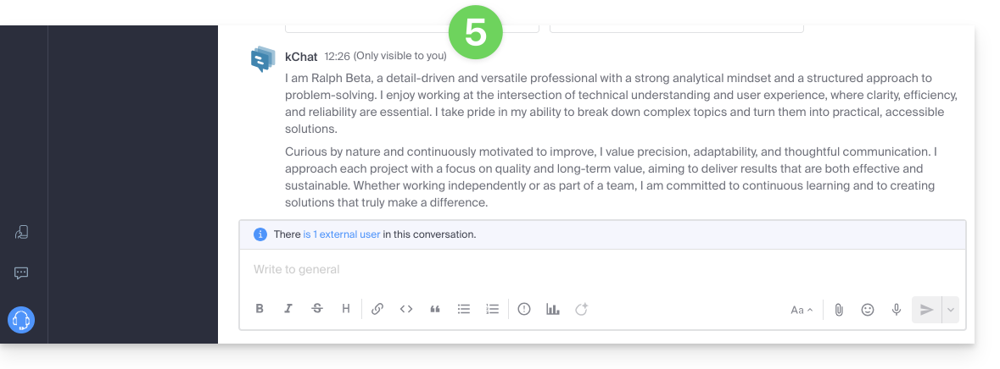
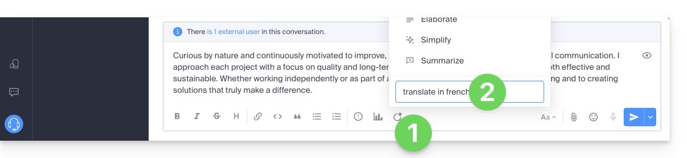
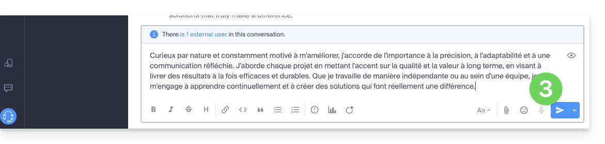

Euria est l'intelligence artificielle d'Infomaniak, intégrée à kChat. Elle peut vous aider à réaliser des calculs, traductions, donner des indications sur différents sujets et répondre à vos questions. Le contenu traité n'est pas capté et est géré exclusivement en Suisse.

## Ajouter Euria aux contacts kChat

Les bots disponibles sur kChat font partie de vos contacts. Pour les trouver :

1. Dans le menu latéral gauche de kChat, cliquez sur la **recherche de canal** (les bots apparaissent également comme canal) ou sur l'icône **+** à côté de **Messages directs**.

    

2. Ajoutez les bots signalés avec l'étiquette `[bot]` ou recherchez le terme *bot* ou *chat*.

:::caution
Ne créez pas une conversation groupée entre les bots et vous-même — cela ne fonctionnera pas. Il faut créer un canal de discussion privée entre chaque bot individuellement et vous-même.
:::

Il suffit ensuite de lui écrire comme si vous conversiez avec une connaissance :

## Traduire un message à la lecture

Pour traduire automatiquement un message rédigé dans une langue étrangère :

1. Rendez-vous sur le message à traduire.
2. Cliquez sur le **menu d'action •••** en haut à droite de l'élément concerné.
3. Cliquez sur **Traduire** :

    

4. Le message traduit s'affiche après le dernier message de votre conversation et n'est visible que par vous-même :

    

## Traduire à la rédaction avec Euria

Vous pouvez demander à Euria de traduire le texte que vous êtes en train de rédiger :

1. Cliquez sur l'icône Euria.
2. Indiquez vos instructions :

    

3. Le texte s'affiche dans la langue désirée et vous pouvez l'envoyer :

    

## Fonctionnalités d'Euria dans kChat

| Fonctionnalité | Description |
|---|---|
| Calculs et analyse | Effectuez des calculs, analysez des données et des pourcentages. |
| Résumés | Résumez de longs échanges en une fraction de seconde. |
| Traduction | Traduisez vos messages dans la langue de vos interlocuteurs. |
| Correction | Corrigez et garantissez des messages parfaitement rédigés. |
| Idées | Demandez des idées de titres, structures de présentation, activités. |
| Rappels | Recevez des [rappels de messages](../conversations/#créer-un-rappel-de-message) via le canal Euria. |
| Planning quotidien | Recevez votre [planning Calendar](../integrations/#planning-quotidien) par kChat. |

:::note
Dès l'ajout d'un nouvel utilisateur dans votre Organisation, ce dernier reçoit un message de Euria lui souhaitant la bienvenue.
:::

---

## Sources

- [Discuter avec Euria via kChat — FAQ 2840](https://faq.infomaniak.com/2840)
- [Traduire le contenu d'un message sur kChat — FAQ 1467](https://faq.infomaniak.com/1467)
