Ce guide détaille les intégrations de kChat avec d'autres produits et services : appels kMeet, webhooks, commandes slash et planning Calendar.

## Démarrer une réunion kMeet depuis kChat

La fonction d'appel est disponible sur toutes les versions Web, mobile et desktop de kChat.

Pour démarrer une conversation orale ou vidéo, appuyez sur le bouton **Appeler** visible sur n'importe quelle conversation kChat, canal privé, public, via l'application ou le navigateur :

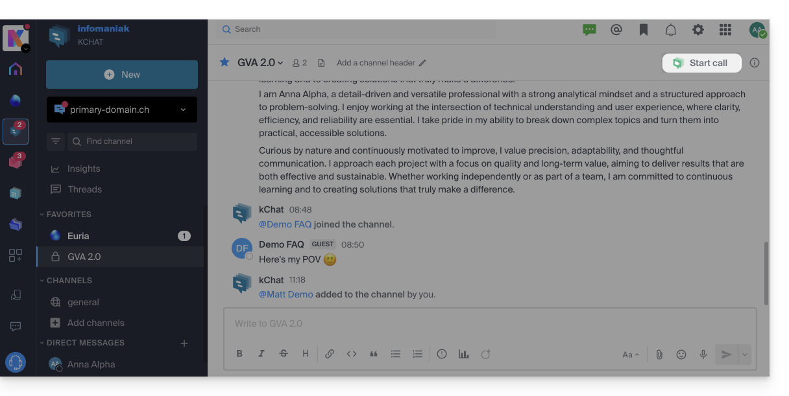

### Comportement

- Appelez directement un utilisateur si vous êtes sur une discussion directe, ou déclenchez un appel à tous les membres d'un canal si vous enclenchez le meeting depuis le canal.
- Appeler un utilisateur en « Ne pas déranger » ne lancera ni sonnerie ni modale d'appel chez lui, il verra toutefois le message dans la conversation.
- Le micro est activé par défaut quand l'appel est accepté, mais pas la caméra.
- Visualisez les utilisateurs de la réunion (qui a accepté, refusé ou manqué) à l'aide des avatars dans le message kChat.
- Une fois l'appel entamé, un emoji apparait dans votre statut kChat pour signifier que vous êtes occupé.
- Un message envoyé depuis la visio (kMeet) sera également visible dans la conversation kChat (et vice-versa).
- Des indications relatives au démarrage et à la clôture de la réunion s'affichent automatiquement dans le fil de conversation :

    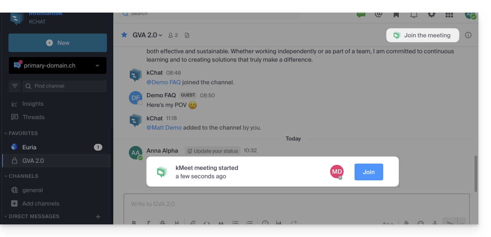

:::note[Appels dans les canaux]
L'appel ne sonnera pas chez les destinataires mais ils verront un message dans kChat ainsi qu'une notification. Un message de prévention apparait si vous lancez un appel dans un canal comprenant plus de 7 utilisateurs.
:::

## Webhooks

Un webhook est une méthode permettant à une application d'être informée immédiatement lorsqu'un évènement se produit dans une autre application :

- **Webhook sortant** : kChat communique des informations à d'autres apps.
- **Webhook entrant** : kChat reçoit des informations d'autres apps pour déclencher des actions.

:::note[Limits selon l'offre]
| Offre | Webhooks entrants/sortants |
|---|---|
| kSuite gratuit | 1 / 1 |
| Standard | 20 / 20 |
| Business | Illimité |
| Enterprise | Illimité |
:::

### Accéder à l'interface webhooks

:::caution
Les utilisateurs externes (Guest) ne voient pas le menu *Intégrations*.
:::

1. Cliquez sur l'icône **Nouveau** vers le nom de votre organisation kChat.
2. Cliquez sur **Intégrations** :

    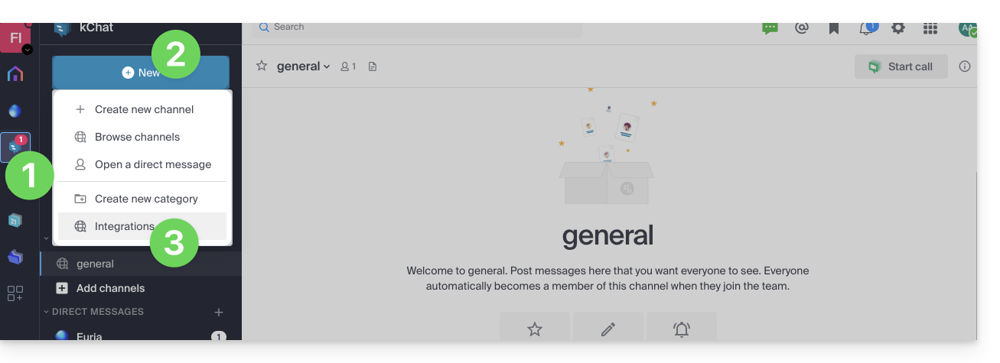

3. Accédez aux catégories :

    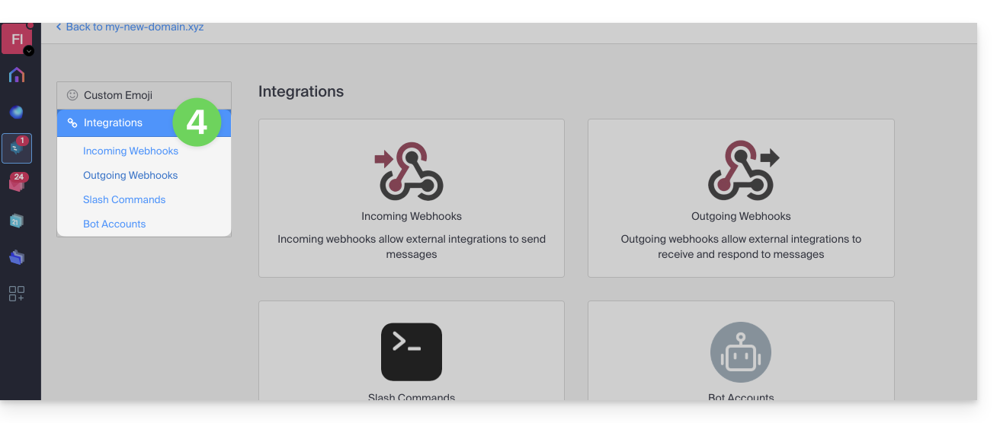

### Créer un webhook entrant

1. Cliquez sur la catégorie **Webhooks entrants**.
2. Cliquez sur le bouton **Ajouter des webhooks entrants** :

    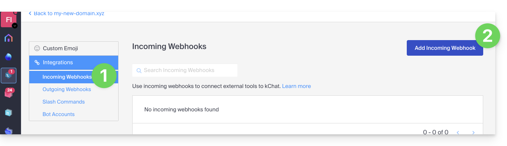

3. Ajoutez un nom et une description.
4. Sélectionnez le canal qui recevra les messages.
5. Cliquez sur **Enregistrer** :

    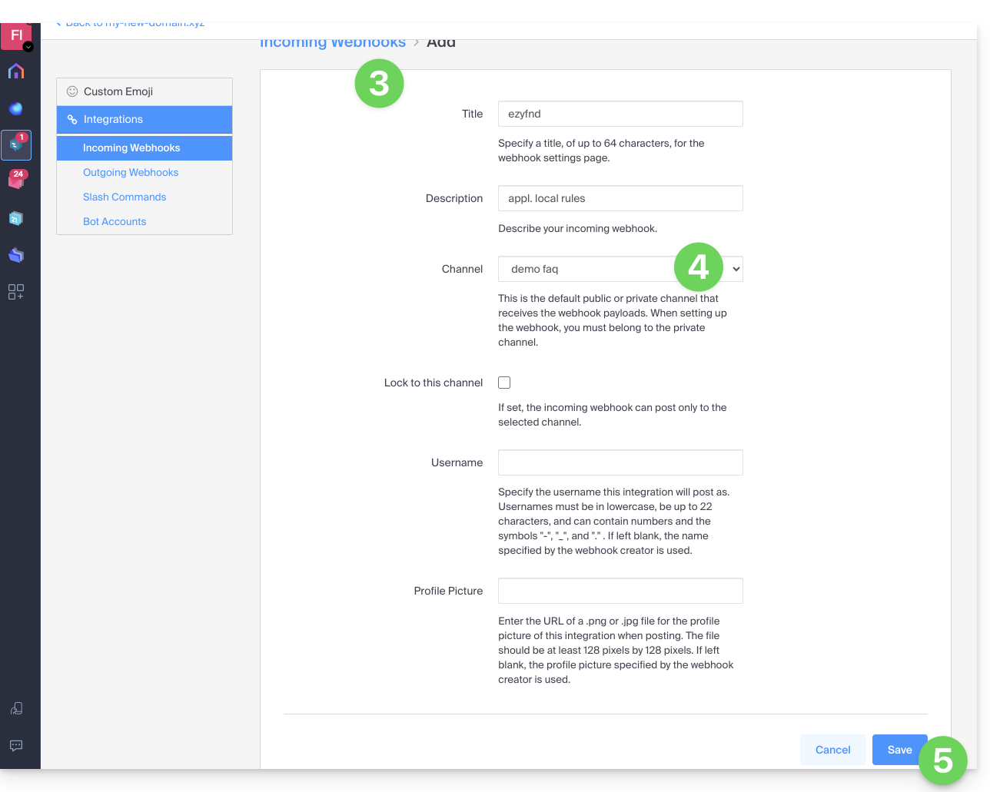

6. L'URL à conserver pour vos développements s'affiche (à ne pas divulguer publiquement) :

    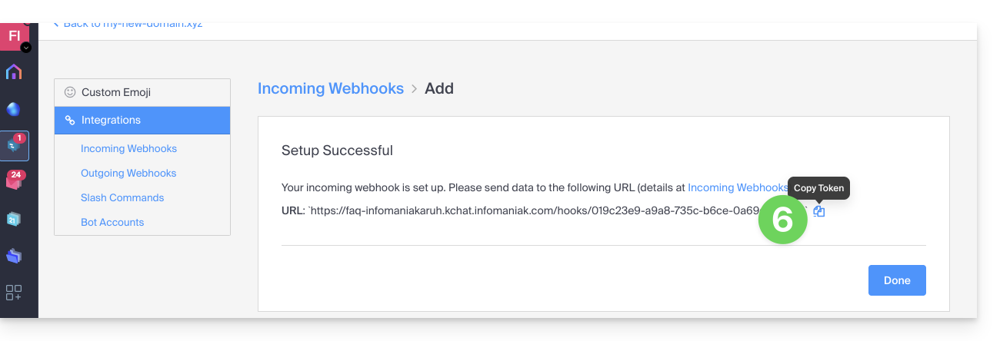

### Utiliser le webhook

Exemple avec `curl` :

```sh
curl -i -X POST -H 'Content-Type: application/json' -d '{"text": "Hello, text1\nText2."}' https://your-server-kchat.xyz/hooks/xxx-key-generated-xxx
```

Le message apparait dans le canal spécifié :

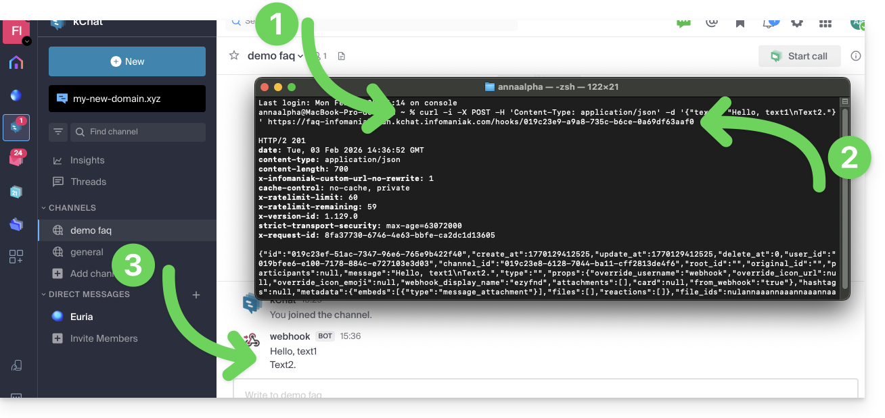

:::note
L'indication **BOT** est ajoutée à côté du nom d'utilisateur sur kChat pour des raisons de sécurité.
:::

### Paramètres supportés

| Paramètre | Description | Requis |
|---|---|---|
| `text` | Message en Markdown. Pour les notifications, utiliser `@username`, `@channel`, `@here`. | Si `attachments` n'est pas défini, oui |
| `channel` | Remplace le canal de destination (nom du canal, pas le nom d'affichage). | Non |
| `username` | Remplace le nom d'utilisateur affiché. | Non |
| `icon_url` | Remplace l'image de profil. | Non |
| `icon_emoji` | Remplace l'image de profil et `icon_url`. | Non |
| `attachments` | Pièces jointes pour une mise en forme plus riche. | Si `text` n'est pas défini, oui |
| `type` | Type de publication (doit commencer par `custom_`). | Non |

:::tip
Pour un format de réponse identique à Slack, ajoutez `?slack_return_format=true` à l'URL du webhook.
:::

### Exemple avancé

```sh
curl -i -X POST -H 'Content-Type: application/json' \
-d '{
  "username": "System Monitor",
  "icon_url": "https://cdn-icons-png.flaticon.com/512/5971/5971593.png",
  "text": "### System Status Report\nEnvironment: PRODUCTION\nStatus: SUCCESSFUL\n\n---\n\n| Component | Version | Build ID | Status |\n|:----------|:-------:|:---------|:-------|\n| API-Core  | 2.4.1   | #88421   | OK     |\n| Web-UI    | 1.9.0   | #88425   | OK     |\n| Database  | 14.5    | N/A      | OK     |"
}' \
https://your-server-kchat.xyz/hooks/xxx-key-generated-xxx
```

Résultat :

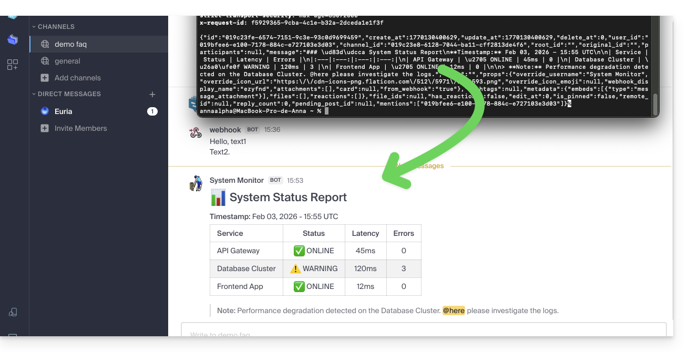

## Commandes slash

Les messages qui commencent par `/` sont interprétés comme des commandes slash.

### Commandes intégrées

| Commande | Description |
|---|---|
| `/away` | Marque votre statut comme « absent » |
| `/offline` | Marque votre statut comme « hors ligne » |
| `/online` | Marque votre statut comme « en ligne » |
| `/dnd` | Marque votre statut comme « ne pas déranger » |
| `/code` | Formate le texte en tant que code |
| `/collapse` | Cache le contenu de l'élément dans le message |
| `/expand` | Étend le contenu de l'élément dans le message |
| `/echo` | Répète le texte qui suit la commande |
| `/header` | Affiche un en-tête dans un message |
| `/purpose` | Définit ou affiche la description du canal |
| `/rename` | Renomme le canal actuel |
| `/leave` | Quitte le canal actuel |
| `/mute` | Met en sourdine le canal actuel |
| `/reminders` | Gère les rappels |
| `/search` | Recherche des messages et d'autres contenus |
| `/settings` | Ouvre les paramètres |
| `/shortcuts` | Affiche les raccourcis clavier |

Si vous tapez uniquement `/`, une modale s'affiche avec les commandes disponibles.

### Créer une commande slash personnalisée

:::caution
Les utilisateurs externes ne voient pas le menu *Intégrations*.
:::

1. Cliquez sur l'icône **Nouveau** vers le nom de votre organisation kChat.
2. Cliquez sur **Intégrations** :

    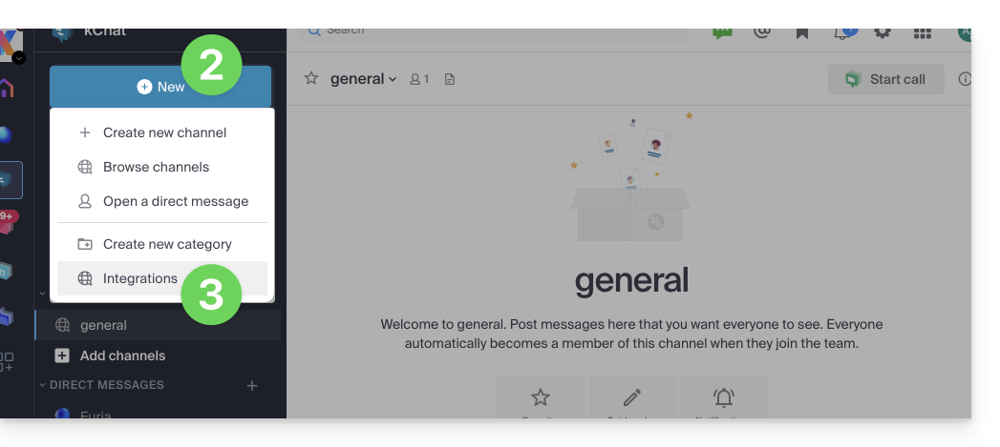

3. Cliquez sur **Commande slash** :

    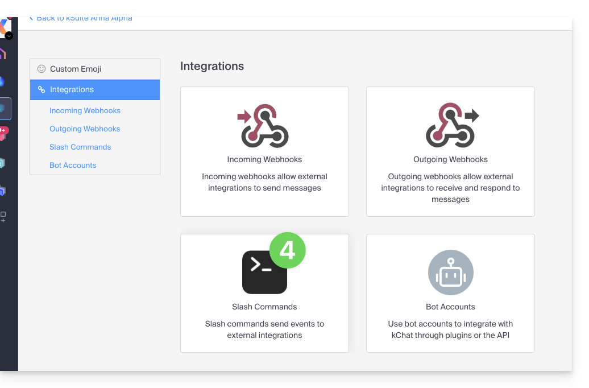

4. Cliquez sur **Ajouter une commande** :

    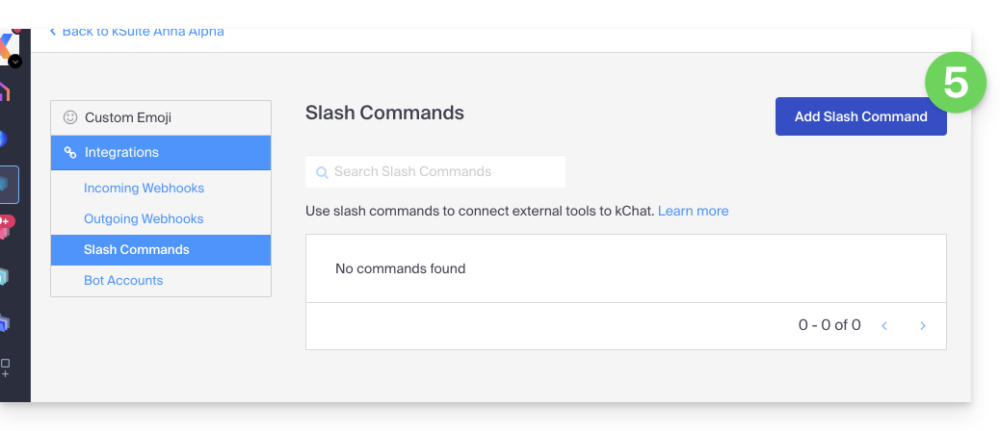

5. Configurez la commande (nom, déclencheur sans le `/`, type de contenu attendu, action à exécuter).
6. **Enregistrez** la commande.

:::note
La création de commandes slash personnalisées peut nécessiter des compétences de programmation, notamment pour intégrer des fonctionnalités externes (appel à une API, exécution d'un script, etc.).
:::

## Planning quotidien

Recevez automatiquement chaque matin dans votre boîte mail et/ou kChat le résumé de vos activités inscrites sur Calendar Infomaniak.

:::note
Cette fonctionnalité est **désactivée** par défaut sur tous les calendriers. L'envoi sur kChat nécessite de posséder kChat au sein de son Organisation.
:::

### Activer le planning

1. Accédez aux [paramètres unifiés](https://ksuite.infomaniak.com/calendar?settings=personalization__reports) de Calendar.
2. Sélectionnez l'Organisation concernée.
3. Cliquez sur **Ajouter un rappel quotidien** :

    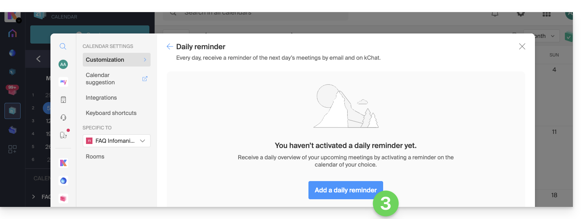

4. Configurez le rappel :
    - Sélectionnez le calendrier concerné.
    - Choisissez le mode de réception (Mail, kChat ou les 2).
    - Choisissez le moment (le soir d'avant ou tôt le jour-même).
    - Incluez ou non les évènements récurrents.
    - Choisissez les jours d'envoi.
5. Validez :

    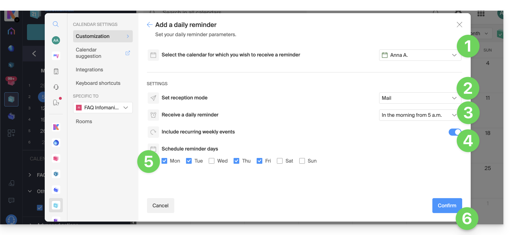

### Désactiver le planning

1. Cliquez sur le lien situé tout en bas de la notification reçue :

    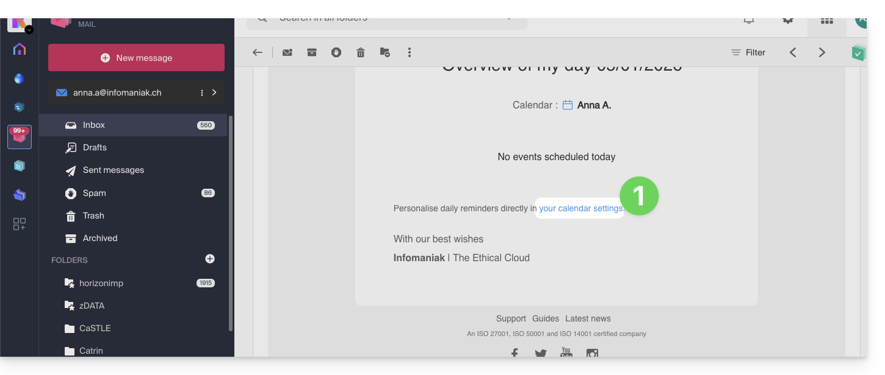

2. Cliquez sur le rappel à éliminer.

3. Supprimez le rappel depuis la page d'édition :

    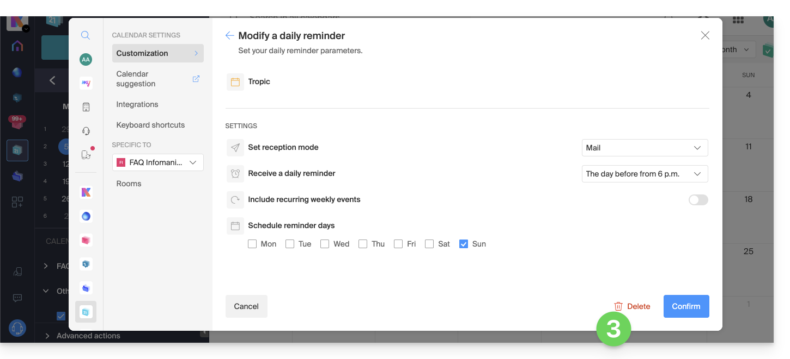

---

## Sources

- [Créer une réunion kMeet depuis kChat — FAQ 2827](https://faq.infomaniak.com/2827)
- [Connecter des applications externes à kChat — FAQ 2001](https://faq.infomaniak.com/2001)
- [Utiliser les commandes slash de kChat — FAQ 2134](https://faq.infomaniak.com/2134)
- [Recevoir son planning quotidien par mail ou kChat — FAQ 1622](https://faq.infomaniak.com/1622)
