Ce guide détaille la gestion des membres de kChat : inviter des utilisateurs kSuite, inviter des utilisateurs externes et gérer les accès aux canaux.

## Prérequis : être administrateur kChat

Pour gérer les membres et invitations, vous devez être **administrateur kChat** :

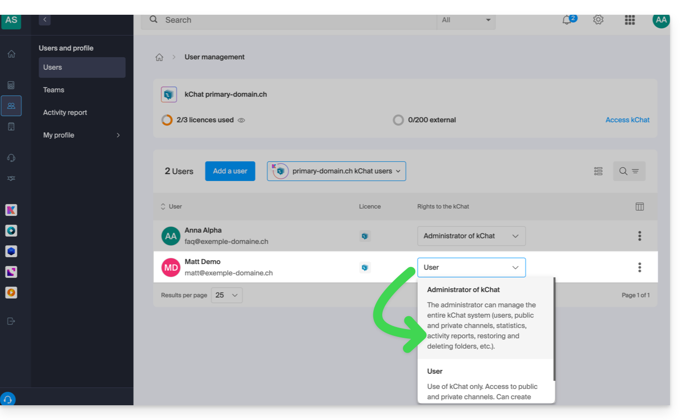

:::caution
Être **administrateur de l'Organisation** dans laquelle se trouve la kSuite ne suffit pas — il faut explicitement être administrateur **kChat** :

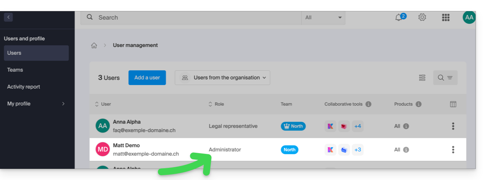
:::

## Inviter un utilisateur kSuite

Cette procédure permet d'ajouter un utilisateur qui sera **comptabilisé comme un utilisateur kSuite** avec des droits dans l'Organisation.

1. Accédez à la [gestion de kChat](https://manager.infomaniak.com/v3/ng/kchat/) sur le Manager Infomaniak.
2. Cliquez sur **Ajouter un utilisateur** :

    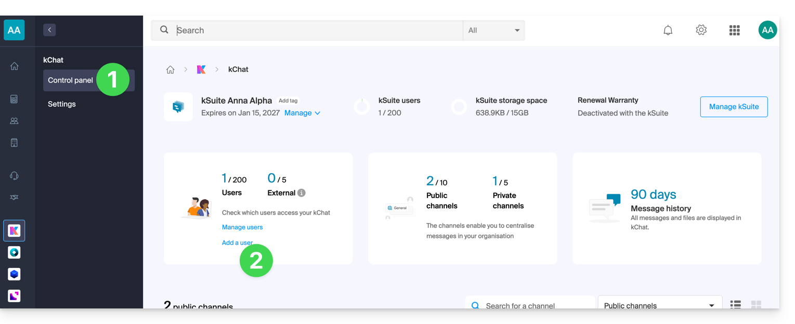

3. Cliquez sur **Créer un utilisateur kSuite**.
4. Cliquez sur **Suivant** :

    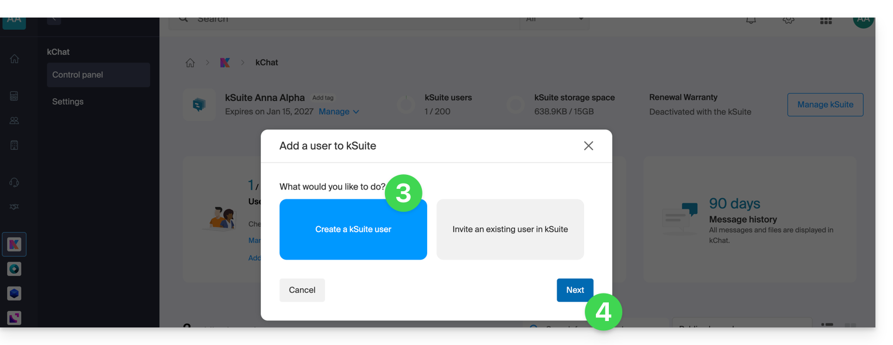

5. Entrez prénom et nom, et définissez le rôle :

    | Rôle | Droits |
    |---|---|
    | Représentant légal | Responsabilité légale, gère tous les produits, utilisateurs et comptabilité. |
    | Administrateur | Gère tous les produits, utilisateurs et comptabilité. |
    | Utilisateur | Gère uniquement les produits que vous autorisez. |

6. Indiquez l'adresse mail existante de l'utilisateur (ne pas créer d'adresse mail). Vous pouvez forcer la connexion avec cette adresse ou autoriser une autre adresse.
7. Activez le bouton à bascule pour **ajouter l'utilisateur à votre kSuite**.
8. Cliquez sur **Inviter** :

    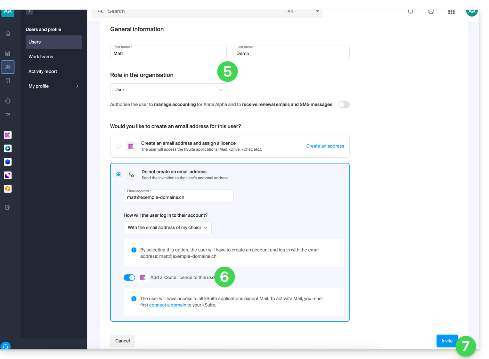

L'invitation est en attente jusqu'à l'inscription définitive :

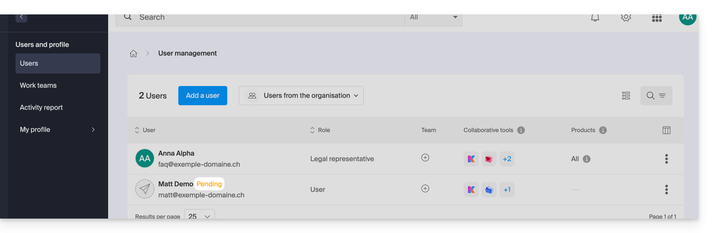

### Accepter l'invitation

1. L'utilisateur invité reçoit l'invitation par mail et clique sur **Accepter l'invitation** :

    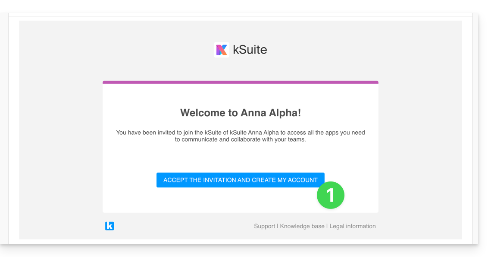

2. Il spécifie ses coordonnées et termine l'inscription :

    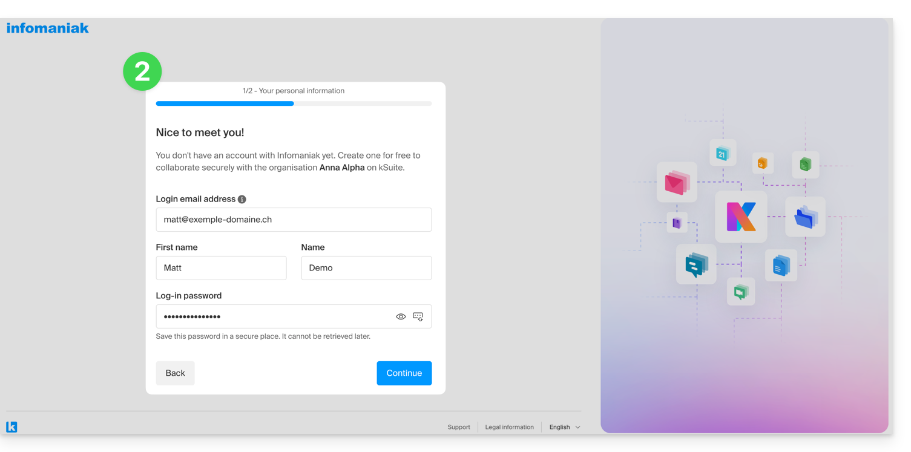

3. Une fois inscrit, l'utilisateur peut se connecter à kChat. Dès son ajout, il reçoit un message de **Euria** lui souhaitant la bienvenue :

    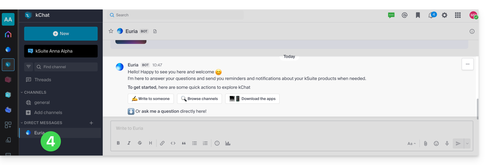

:::note[Utilisation vs gestion]
Le nouvel utilisateur a accès à l'app kChat, mais ne peut pas gérer la kSuite (son rôle ne l'y autorise pas). Il devra basculer vers les **applications Infomaniak** via le menu en haut à droite :

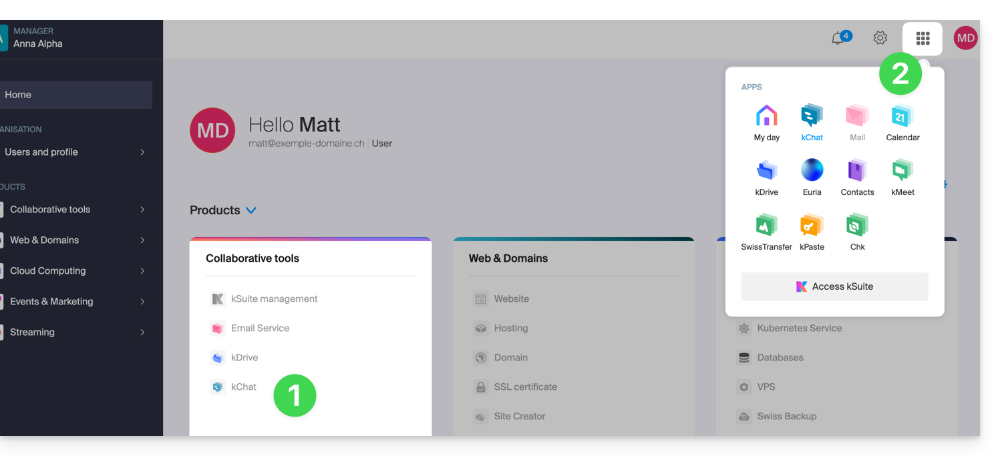
:::

## Inviter un utilisateur externe (Guest)

Un administrateur kChat peut inviter un utilisateur **totalement externe** à l'Organisation qui ne sera **pas comptabilisé comme un utilisateur kSuite**. Ce dernier sera invité à créer un compte Infomaniak s'il n'en possède pas un.

1. Accédez à l'app Web [kchat](https://ksuite.infomaniak.com/kchat) ou l'app desktop.
2. Cliquez sur le bouton **Inviter des membres** :

    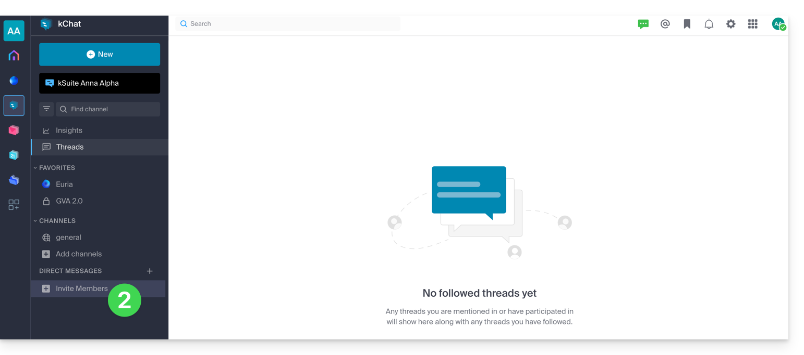

3. Spécifiez l'adresse mail de la personne à inviter.
4. Cliquez sur son adresse mail pour l'ajouter en tant qu'invité :

    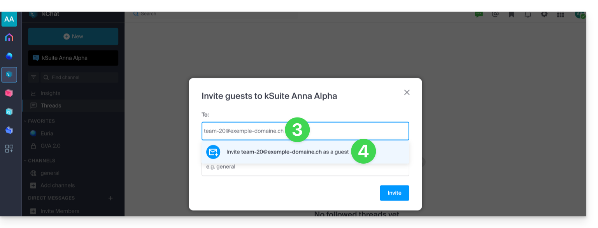

5. Spécifiez le ou les canaux auxquels ces personnes pourront accéder.
6. Cliquez sur le bouton bleu pour envoyer l'invitation :

    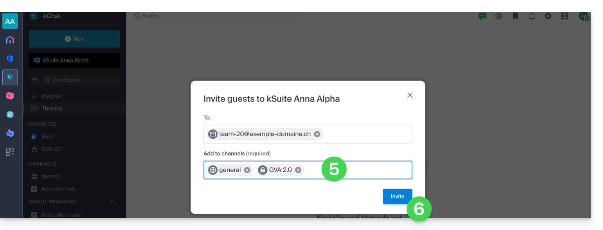

7. La personne invitée reçoit un mail avec un lien conduisant vers l'interface kChat et le canal partagé :

    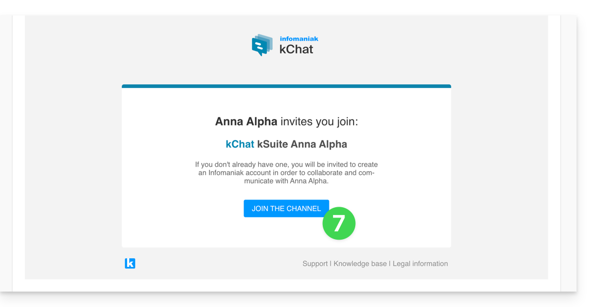

8. Si l'utilisateur n'a pas de compte Infomaniak, une phase d'inscription est nécessaire (pendant ce temps, il est listé *en attente*) :

    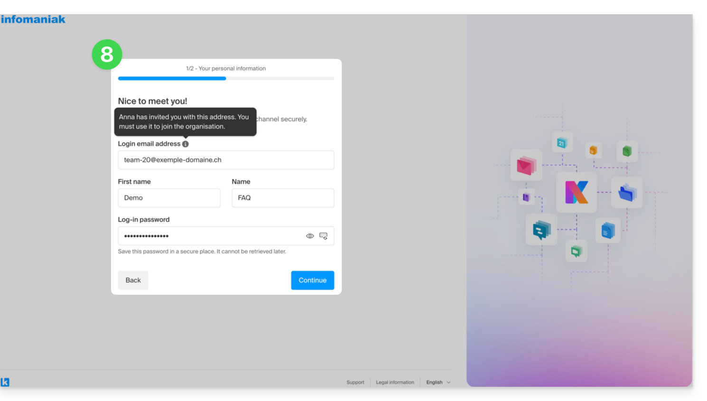

    :::note
    L'invité n'est pas listé en attente dans kSuite car il s'agit d'un utilisateur restreint et externe. Tant qu'il n'a pas finalisé son inscription, le quota reste à 0 utilisateur externe :

    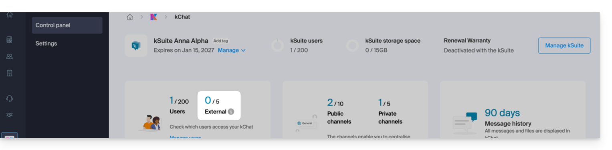
    :::

9. Une fois l'inscription terminée, l'invité accède à kChat, une version restreinte et limitée aux canaux spécifiés :

    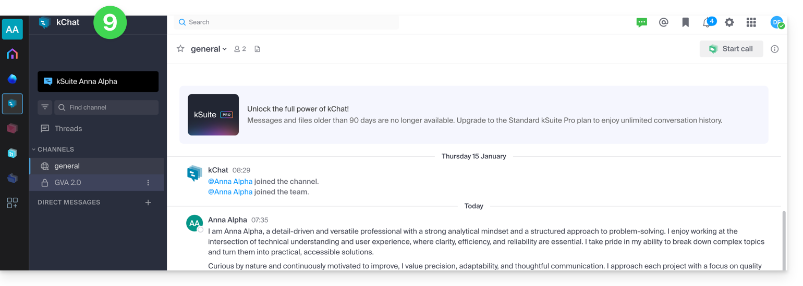

10. Il peut commencer une conversation privée avec les autres utilisateurs du canal.

11. Côté administrateur, le tableau de bord indique l'utilisateur externe :

    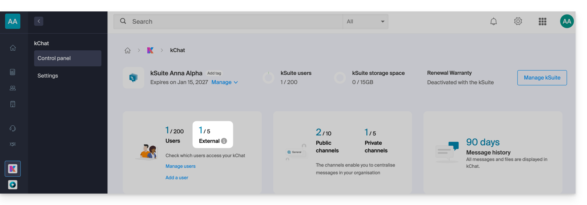

### Permissions des invités

| Les invités peuvent… | Les invités ne peuvent pas… |
|---|---|
| Épingler des messages | Découvrir des canaux publics |
| Utiliser des slash commands (sauf commandes restreintes) | Rejoindre des groupes ouverts |
| Mettre un canal en favori | Créer des messages directs avec des membres hors canal |
| Rendre silencieux un canal | Inviter des personnes |
| Mettre à jour leur profil | |
| Utiliser des méthodes d'authentification différentes | |
| Utiliser l'application kChat (Web, mobile ou desktop) | |

## Voir les membres d'un canal

1. Cliquez sur l'icône de personnage à droite du titre du canal.
2. Les participants s'affichent sur la droite de kChat :

    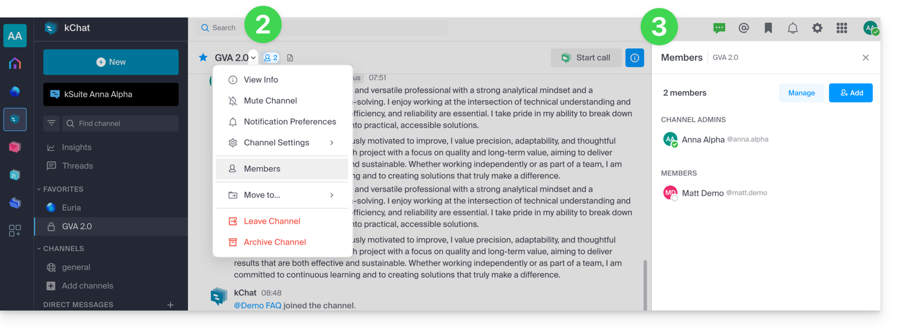

## Gérer les membres d'un canal privé

1. Le bouton **Gérer** permet de retirer un membre ou de le nommer **Administrateur** du canal :

    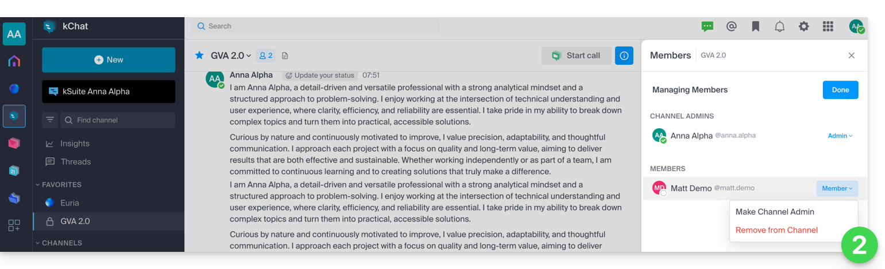

2. Le bouton **Ajouter** permet d'inviter un utilisateur kChat ou un **groupe** complet n'ayant pas encore accès à ce canal :

    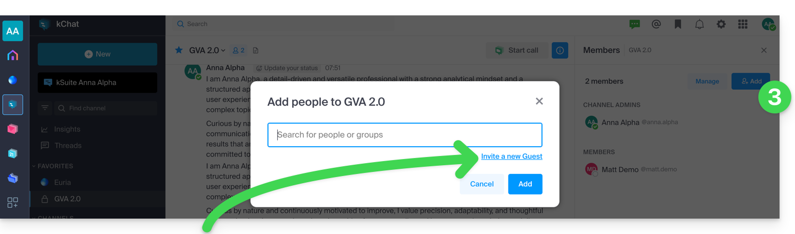

:::tip
Prenez connaissance de la section [Inviter un utilisateur externe](#inviter-un-utilisateur-externe-guest) ci-dessus pour l'ajout d'invités ne consommant pas de licence kSuite.
:::

---

## Sources

- [Inviter un utilisateur à utiliser kChat — FAQ 1455](https://faq.infomaniak.com/1455)
- [Inviter un utilisateur externe à utiliser kChat — FAQ 2846](https://faq.infomaniak.com/2846)
- [Gérer les membres de kChat — FAQ 1886](https://faq.infomaniak.com/1886)
