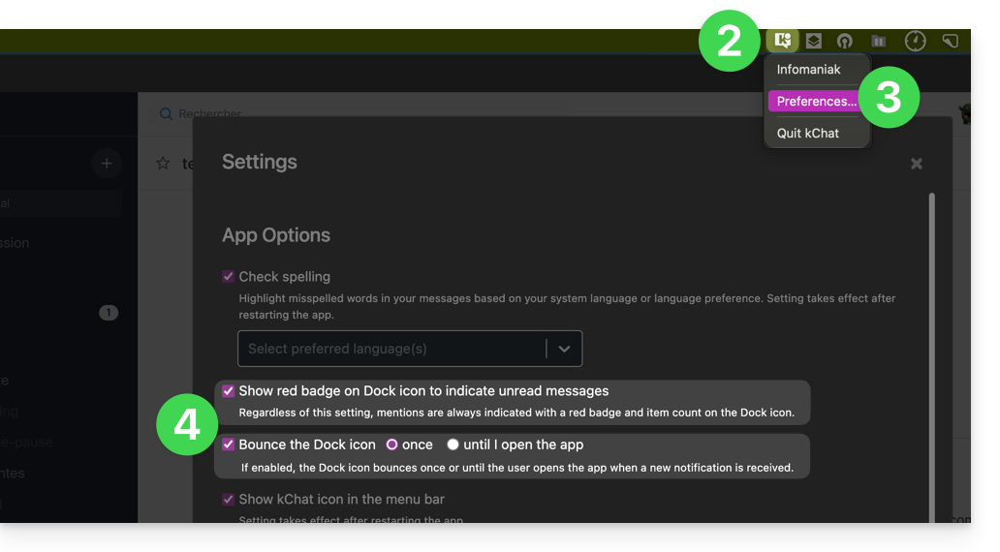
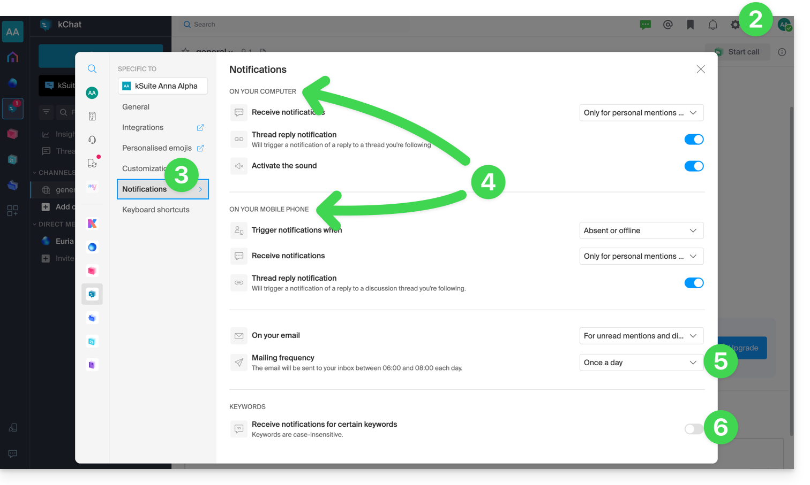
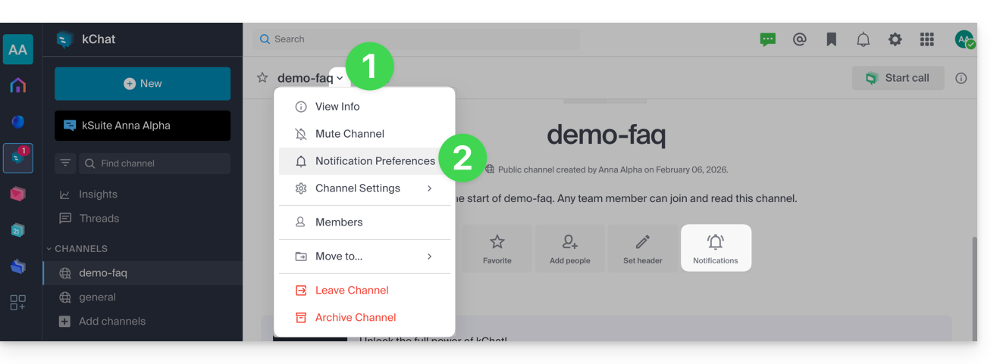
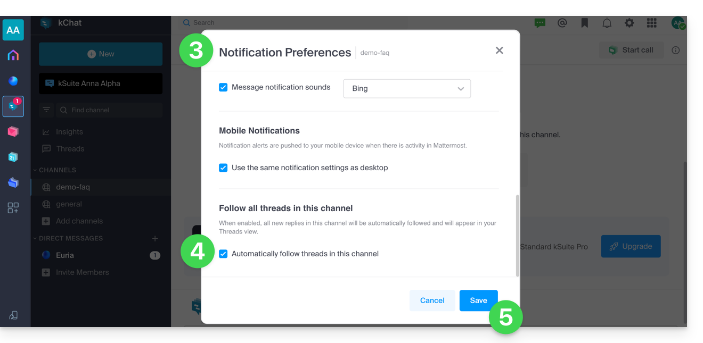
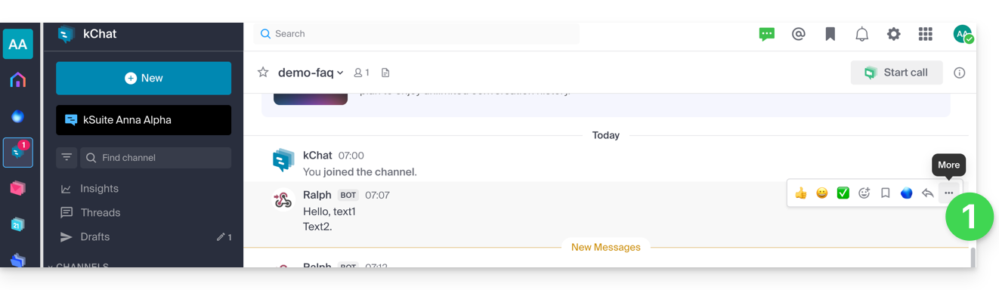
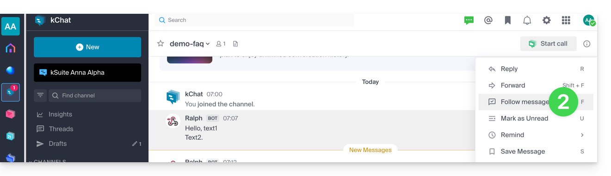
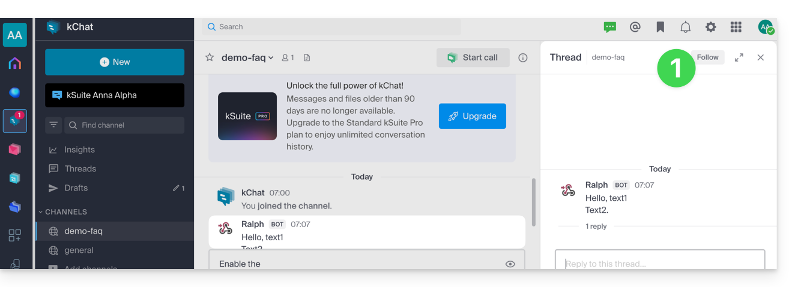

Ce guide détaille la configuration des notifications kChat pour ne rien manquer des discussions qui vous concernent.

:::tip
Si les notifications sont correctement configurées sur l'app mobile kChat, elles fonctionneront également sur les montres connectées (Garmin, Apple Watch).
:::

## Notifications de l'icône de l'app desktop

Vous pouvez décider d'animer l'icône de l'app desktop lors d'un nouveau message :

1. Ouvrez l'app desktop kChat.
2. Faites un clic gauche sur l'icône de l'app desktop dans la zone de notification (en haut à droite sur macOS, en bas à droite sur Windows, double clic gauche dans la barre des tâches sur Linux).
3. Cliquez sur **Préférences...**.
4. Sous **Options de l'application**, réglez les préférences de notification du système d'exploitation :

    

## Notifications des discussions et évènements

1. Accédez à l'app Web kChat ou ouvrez l'app mobile ou desktop.
2. Cliquez sur l'icône **Paramètres** en haut à droite.
3. Cliquez sur **Notifications**.
4. Définissez la manière d'être notifié (**ordinateur**/**mobile**, présent/absent, etc.) et dans quel cas (tout message ou seulement message avec mention, message suivi, etc.).
5. Choisissez de recevoir régulièrement des notifications par e-mail :
    - Cet e-mail est envoyé soit **tous les jours** soit **1 fois par semaine**, entre 6 et 8 heures du matin.
    - L'utilisateur reçoit un mail par produit kChat auquel il a accès.
6. Définissez un mot-clé pour lequel être averti lorsqu'un nouveau message est publié :

    

## Notifications d'un canal précis

1. Cliquez sur le chevron à droite du nom du canal concerné.
2. Cliquez sur **Préférences de notification** (ou directement sur l'icône dédiée en haut du canal) :

    

3. Activez les différentes notifications souhaitées. Une des options permet d'être automatiquement notifié dès qu'un [fil de discussion](../conversations/#fil-de-discussion-thread) s'engage.
4. Sauvegardez vos choix :

    

## Suivre un fil de discussion précis

Pour être notifié d'un nouveau message dans un fil de discussion précis, même si vous n'êtes pas directement participant, activez le **Suivi** :

- Depuis le menu d'action **•••** à droite d'un message, cliquez sur **Plus...** puis **Suivre le message** :

    

    

- Dans un fil de discussion, cliquez sur **Suivre** en haut de la discussion. Vous suivez automatiquement la discussion dès que vous postez un message :

    

---

## Sources

- [Gérer les notifications kChat — FAQ 1460](https://faq.infomaniak.com/1460)
