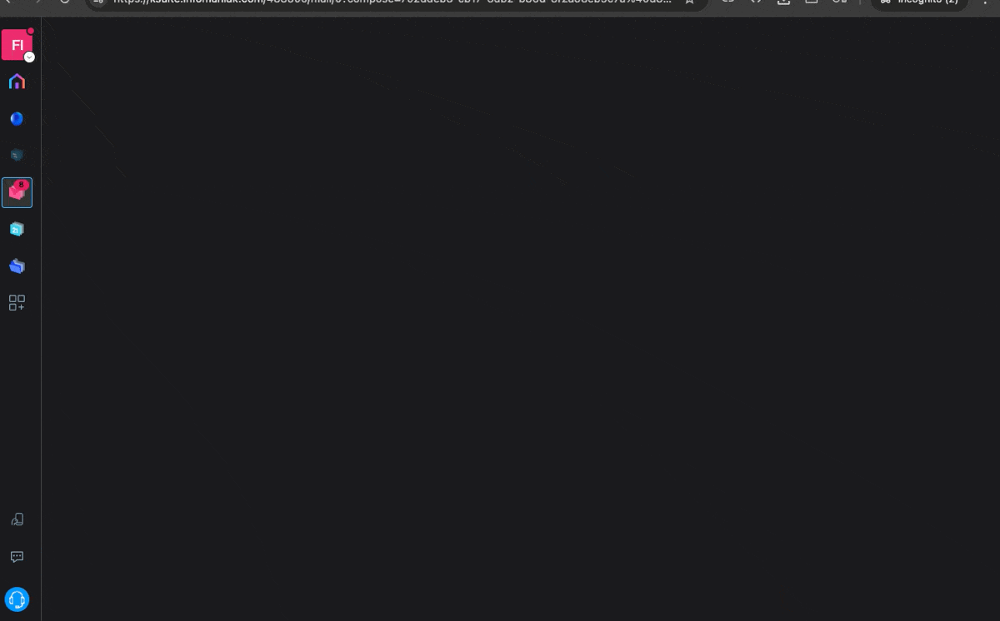
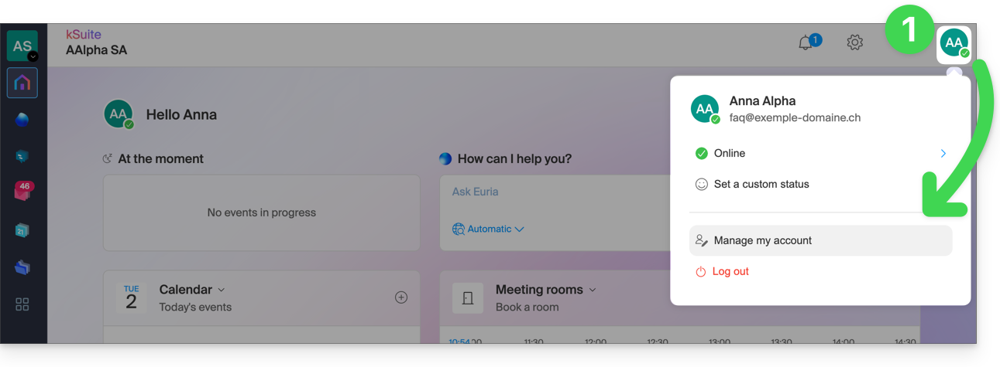
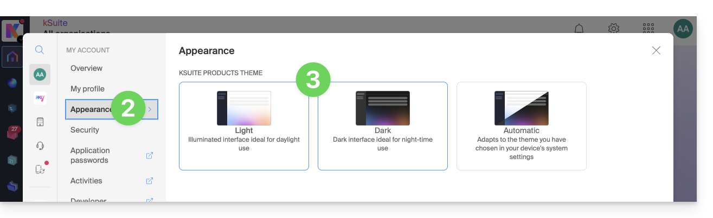
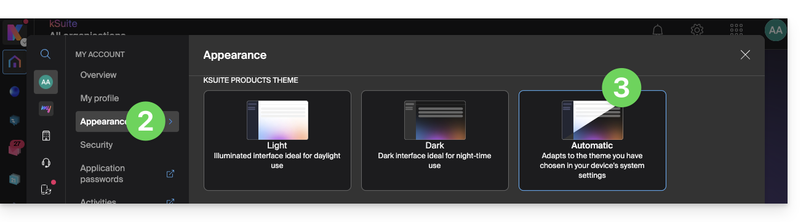
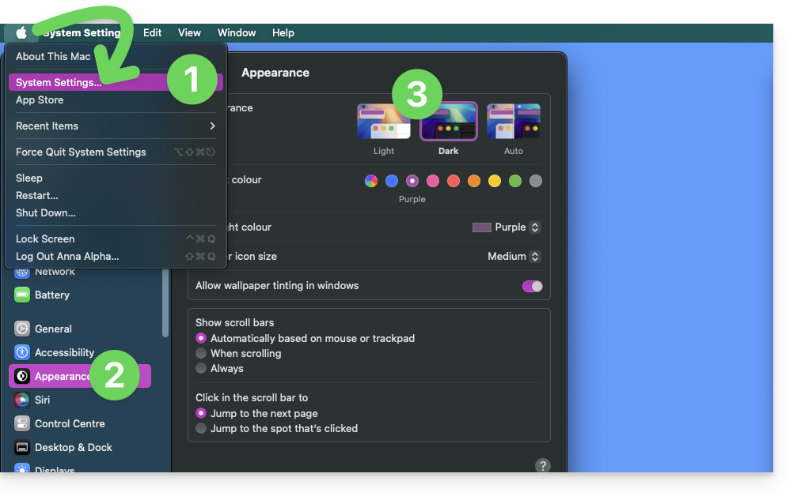
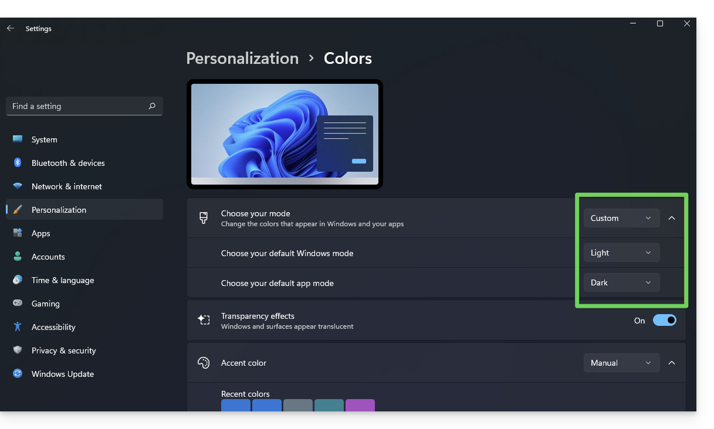

Ce guide détaille les plateformes compatibles avec kChat et la gestion du mode sombre (dark mode).

## Plateformes compatibles

| Plateforme | Accès |
|---|---|
| Web | [ksuite.infomaniak.com/kchat](https://ksuite.infomaniak.com/kchat) |
| macOS | Application de bureau |
| Windows | Application de bureau |
| Linux | Application de bureau (.AppImage) |
| iOS (iPhone / iPad) | App Store |
| Android | Google Play |

Téléchargement : [infomaniak.com/fr/applications/telecharger-kchat](https://www.infomaniak.com/fr/applications/telecharger-kchat).

:::note
Il n'est pas possible de modifier l'emplacement du dossier `kchat-desktop` sur votre disque dur. Le contenu des discussions est stocké en ligne sur les serveurs sécurisés d'Infomaniak.
:::

## Gérer le dark mode (mode sombre)

Les outils Infomaniak, comme kChat, peuvent s'afficher en mode **clair** ou mode **sombre**, y compris en se basant sur les réglages de votre système d'exploitation :

### Activer un mode manuel

Pour choisir manuellement un affichage sombre ou clair :

1. Cliquez sur la pastille avec vos initiales/avatar en haut à droite, puis **Gérer mon compte** :

    

2. Cliquez sur **Apparence** dans le menu latéral gauche.
3. Cliquez sur **Clair** pour le mode clair :

    

4. Cliquez sur **Sombre** pour activer le dark mode.

### Activer le mode automatique

Le mode automatique se base sur les paramètres de votre système d'exploitation :

1. Cliquez sur la pastille avec vos initiales/avatar en haut à droite, puis **Gérer mon compte**.
2. Cliquez sur **Apparence** dans le menu latéral gauche.
3. Cliquez sur le mode **Automatique** :

    

### Modifier le thème du système d'exploitation

#### Sur macOS

1. Menu Pomme > **Réglages Système**.
2. Cliquez sur **Apparence**.
3. Choisissez le mode désiré :

    

#### Sur Windows

1. Menu **Démarrer** > **Paramètres** > **Personnalisation**.
2. Sélectionnez **Couleurs**, puis **Choisissez votre mode** :

    

3. Choisissez entre **Clair**, **Sombre** ou **Personnalisé**.

:::tip[Mobile]
Le thème sombre est activé sur les appareils mobiles pour les pages de connexion et de création de compte. Il s'adapte automatiquement aux préférences du système mobile.
:::

---

## Sources

- [Télécharger et installer kChat — FAQ 144](https://faq.infomaniak.com/144)
- [Gérer le dark mode (mode sombre) — FAQ 2870](https://faq.infomaniak.com/2870)
