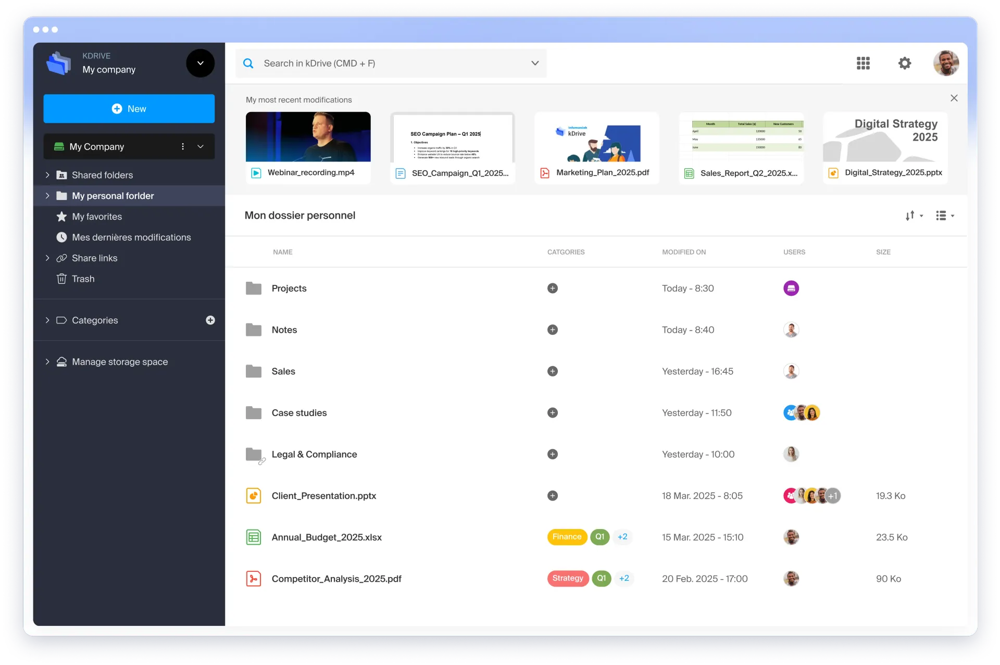
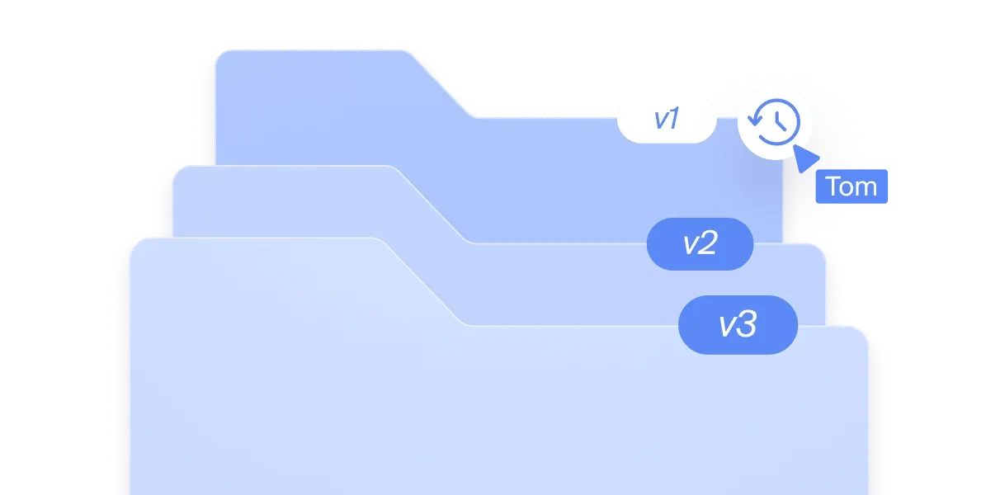
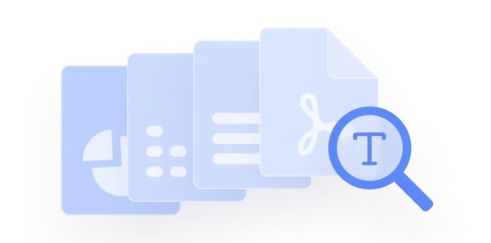
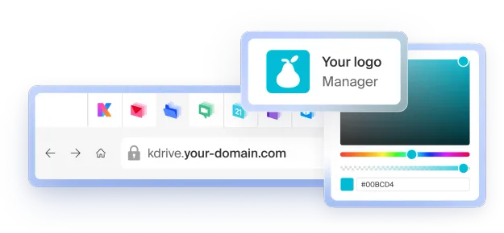

kDrive est le cloud collaboratif d'Infomaniak : **sécurisé, souverain et parfaitement intégré à kSuite**. Stockez, partagez et collaborez sur vos fichiers depuis n'importe quel appareil, avec la garantie que vos données restent en Suisse.

## Atouts principaux

- **Stockage souverain** : données hébergées et développées exclusivement en Suisse.
- **Triple sauvegarde** : chaque fichier est sécurisé sur trois supports répartis sur deux datacenters.
- **Collaboration en temps réel** : éditez en ligne avec OnlyOffice ou Microsoft Office.
- **Partage sécurisé** : liens protégés par mot de passe, boîtes de dépôt, sans compte requis.
- **Recherche par IA** : retrouvez instantanément du texte dans images, PDF et documents.
- **Multiplateforme** : web, desktop (macOS, Windows, Linux), mobile (iOS, Android).
- **Conforme au RGPD et à la nLPD** : aucun compromis sur la confidentialité.

## Un cloud suisse de confiance

kDrive est développé par Infomaniak, une entreprise suisse indépendante :

- Données chiffrées et sauvegardées dans deux datacenters.
- Aucune revente ni analyse de vos données.
- Service client par téléphone et e-mail basé en Suisse.
- Conformité totale avec le RGPD et la nLPD.
- Hors de portée des législations extra-territoriales comme le Cloud Act.

## Collaboration en ligne

kDrive intègre nativement deux suites bureautiques pour travailler en temps réel :

| Suite | Disponibilité | Description |
|---|---|---|
| **OnlyOffice** | Gratuit pour tous | Alternative open source à Microsoft Office : Docs, Grids, Points. |
| **Microsoft 365** | kDrive Pro, kSuite Pro & Enterprise | Word, Excel, PowerPoint hébergés en Suisse chez Infomaniak. |

Voir [OnlyOffice](onlyoffice/) et [Microsoft 365](microsoft-365/) pour les détails.

## Fonctionnalités clés

| Fonctionnalité | Description |
|---|---|
| Machine à remonter le temps | Récupérez n'importe quelle ancienne version de vos documents. |
| Recherche IA | Retrouvez du texte dans le contenu de vos images, PDF et documents. |
| Boîtes de dépôt | Recevez des fichiers de tiers sans compte Infomaniak. |
| Partage par lien | Liens publics ou protégés par mot de passe, avec date d'expiration. |
| Synchronisation sélective | Libérez de l'espace sur vos appareils, gardez uniquement le nécessaire en local. |
| Lite Sync | Consultez vos fichiers sans les stocker physiquement sur votre disque. |
| Éditeur de photos | Rotate, recadrez, ajustez la luminosité et le contraste directement en ligne. |
| Signature PDF | Créez et apposez votre signature sur des documents PDF. |
| Migration automatique | Importez depuis Dropbox ou OneDrive en quelques clics. |
| SSO | Authentification unique pour les entreprises. |
| Custom Brand | Personnalisez kDrive avec votre logo, vos couleurs et votre URL. |

## IA souveraine

kDrive intègre une IA souveraine qui respecte votre vie privée :

- **Recherche intelligente** dans le contenu de vos images, documents et PDF.
- Vos données ne sont jamais envoyées à un tiers.
- Traitement exclusif en Suisse.

## Personnalisation avec Custom Brand

Avec l'option **Custom Brand**, personnalisez kDrive avec votre logo, vos couleurs et l'URL de votre nom de domaine. Vos clients sont immergés de bout en bout dans votre univers de marque.

## Offres kDrive

| Offre | Stockage | Public |
|---|---|---|
| **my kSuite** | 15 Go gratuits (extensible jusqu'à 6 To) | Particuliers |
| **kDrive Solo** | Dès 3 To | Indépendants |
| **kDrive Team / Pro** | Dès 15 Go par utilisateur | Équipes |
| **kSuite Pro** | Dès 15 Go par utilisateur + kChat + Mail | Entreprises |
| **kSuite Enterprise** | Stockage avancé + Microsoft 365 | Grandes organisations |

kDrive est inclus avec kSuite. Voir [Démarrage](demarrage/) pour activer votre espace.

## Éthique et souveraineté

kDrive s'inscrit dans la démarche d'Infomaniak en faveur d'un cloud éthique :

- **Aucune publicité** et aucune exploitation publicitaire des données.
- **Respect de la vie privée** : données hébergées en Suisse, sous droit suisse.
- **Souveraineté numérique** : infrastructure indépendante, hors Cloud Act.
- **Engagement durable** : datacenters alimentés en énergie renouvelable, 200% de compensation CO₂.

---

## Sources

- [Page produit kDrive](https://www.infomaniak.com/fr/ksuite/kdrive)
- [FAQ kDrive](https://www.infomaniak.com/fr/support/faq/admin2/kdrive)
