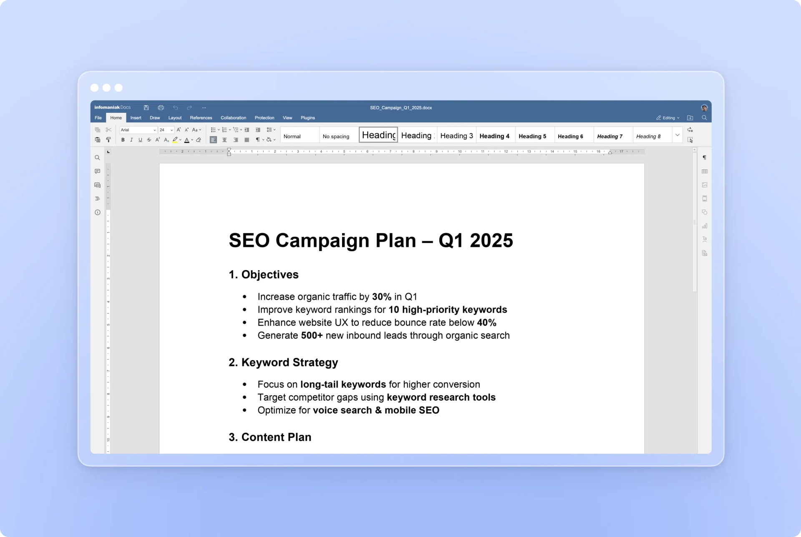

kDrive intègre nativement **OnlyOffice**, la meilleure alternative gratuite et open source à Microsoft Office et Google Workspace. Collaborez sans limite sur vos documents Word, Excel et PowerPoint, même hors ligne.

## Three applications

| Application | Équivalent Microsoft | Description |
|---|---|---|
| **Docs** | Word | Colonnes, table des matières, publipostage, équations, graphiques, tableaux, formes. |
| **Grids** | Excel | Plus de 400 fonctions et formules, tableaux croisés dynamiques, macros, tri et filtrage. |
| **Points** | PowerPoint | Structurez vos présentations avec colonnes, graphiques, tableaux et formes. |

## Collaboration en temps réel

kDrive + OnlyOffice permet de travailler ensemble en temps réel :

- **Co-édition** : plusieurs personnes modifient le même document simultanément.
- **Commentaires** : ajoutez des commentaires et suggérez des modifications.
- **Outils de révision** : suivez les changements, acceptez ou refusez les modifications.
- **Compatibilité Microsoft Office** : ouvrez, éditez et partagez vos documents `.docx`, `.xlsx`, `.pptx` sans contraintes.

## Accès depuis tous vos appareils

Modifiez vos documents en déplacement et invitez facilement vos contacts à lire, modifier ou réviser votre travail. Votre mobile et votre tablette deviennent une véritable station de travail.

## Mode hors ligne

Installez gratuitement OnlyOffice sur tous vos appareils pour modifier et réviser vos documents hors ligne. Une fois en ligne, kDrive synchronisera automatiquement tous vos changements.

:::tip
Téléchargez OnlyOffice gratuitement sur [onlyoffice.com](https://www.onlyoffice.com/).
:::

## Sécurité et confidentialité

kDrive avec OnlyOffice garantit une confidentialité maximale :

- **Développé et hébergé en Suisse** par une entreprise indépendante.
- **Conforme aux lois suisses et européennes** (RGPD, nLPD).
- **Stockage multi-sites** : chaque fichier est sécurisé sur trois supports répartis sur deux datacenters.
- **Partages sécurisés** : contrôle précis des accès, boîtes de dépôt, même sans compte Infomaniak.
- **Vos fichiers ne sont jamais analysés** et sont exclusivement stockés en Suisse.

## OnlyOffice vs Microsoft 365

| Critère | OnlyOffice | Microsoft 365 |
|---|---|---|
| Prix | Gratuit | Abonnement requis (kDrive Pro / kSuite Pro & Enterprise) |
| Open source | Oui | Non |
| Compatibilité MS Office | Oui (`.docx`, `.xlsx`, `.pptx`) | Native |
| Hors ligne | Via l'app desktop OnlyOffice | Via Microsoft Office desktop |
| Collaboration temps réel | Oui | Oui |
| Hébergement | Suisse (Infomaniak) | Suisse (Infomaniak) |

:::note
kDrive intègre aussi Microsoft 365 pour ceux qui préfèrent leurs outils habituels. Voir [Microsoft 365](../microsoft-365/).
:::

---

## Sources

- [Page produit OnlyOffice](https://www.infomaniak.com/fr/ksuite/kdrive/onlyoffice)
- [Page produit kDrive](https://www.infomaniak.com/fr/ksuite/kdrive)
