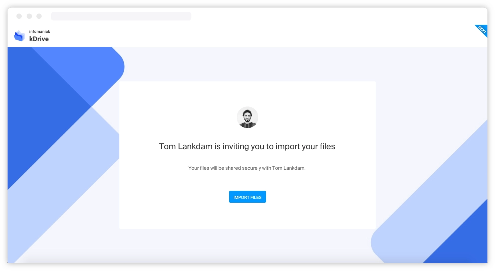

Ce guide explique comment partager des fichiers et dossiers, gérer les accès et utiliser les boîtes de dépôt dans kDrive.

## Partager un fichier ou un dossier

kDrive offre deux modes de partage principaux :

### Lien de partage public

Le lien de partage permet de partager un fichier ou un dossier sans que le destinataire ait besoin d'un compte Infomaniak.

1. Faites un **clic droit** sur le dossier ou fichier concerné.
2. Choisissez **Partager**.
3. Restez sur le **premier onglet** (lien de partage).
4. Activez le lien de partage public.
5. Ajustez les paramètres de sécurité :
   - **Mot de passe** : protégez le lien par mot de passe.
   - **Date d'expiration** : définissez une date de fin de validité.
   - **Droits** : lecture seule, modification, ou téléchargement.
6. Copiez le lien pour le transmettre, ou envoyez-le directement depuis la fenêtre.

:::tip
Aucun compte Infomaniak n'est requis pour accéder à un lien de partage public. Vos destinataires peuvent consulter et télécharger les fichiers sans inscription.
:::

### Invitation par e-mail

Pour inviter une personne spécifique à collaborer sur un dossier :

1. Faites un **clic droit** sur le dossier concerné.
2. Choisissez **Partager**.
3. Cliquez sur le **second onglet** (invitation).
4. Indiquez l'**adresse e-mail** de l'utilisateur concerné.
5. Choisissez le niveau de permission : **Consulter** ou **Modifier**.
6. Cliquez sur **Envoyer l'invitation**.

La personne invitée reçoit un e-mail pour s'inscrire ou se connecter. Une fois connectée, elle accède au contenu partagé via la section « Partagé avec moi ».

:::note[Utilisateur externe]
Un utilisateur externe invité à un kDrive peut :
- Accéder au contenu partagé uniquement (pas au kDrive entier).
- Modifier le contenu partagé (sans effacer le contenu existant au moment du partage).
- Ajouter ou effacer son propre contenu.
- Il n'a pas d'espace privé personnel.
- Il doit passer par l'interface en ligne pour accéder aux fichiers.
:::

## Dossiers de l'organisation

Le dossier **Dossiers de l'organisation** est un espace commun partagé avec tous les membres du kDrive. Il est possible de limiter l'accès à certains sous-dossiers :

- Un **lien de partage public** donne accès en lecture seule à un dossier précis.
- Une **invitation par e-mail** avec droits de modification permet à un utilisateur externe de collaborer sur un sous-dossier spécifique, sans accès au reste du dossier commun.

## Boîtes de dépôt

Les boîtes de dépôt permettent de recevoir des fichiers de tiers, même s'ils ne possèdent pas de compte Infomaniak.

1. Faites un clic droit sur un dossier.
2. Choisissez **Partager**.
3. Activez la **boîte de dépôt**.
4. Partagez le lien avec vos partenaires ou clients.
5. Ils peuvent vous envoyer des fichiers directement dans ce dossier, sans accès au reste du contenu.

## Partages sécurisés avancés

kDrive assure un contrôle précis des accès et des partages :

- **Protection par mot de passe** : sans contrainte pour vos destinataires, aucun compte requis.
- **Dates d'expiration** : les liens expirent automatiquement à la date choisie.
- **Gestion des liens** : visualisez et gérez tous vos liens de partage depuis une interface dédiée.
- **Droits granulaires** : lecture seule, modification, téléchargement, impression.

:::caution
Les partages sécurisés avancés (droits granulaires, dates d'expiration, mot de passe) sont disponibles avec les offres kSuite Pro et Enterprise ou kDrive Pro.
:::

## Personnalisation des partages avec Custom Brand

Avec l'option **Custom Brand**, personnalisez vos liens de partage à votre image :

- **Couleur** : choisissez la couleur du lien de partage.
- **Image** : ajoutez une image de fond (max 500 ko).
- **Logo** : ajoutez votre logo (max 500 ko).
- **URL personnalisée** : utilisez votre propre nom de domaine pour les liens de partage.

Vos clients sont immergés dans votre univers de marque lors du téléchargement de fichiers.

---

## Sources

- [Page produit kDrive — Partage](https://www.infomaniak.com/fr/swisstransfer-kdrive)
- [Gérer le partage des Dossiers de l'organisation — FAQ 1793](https://faq.infomaniak.com/1793)
- [Page produit kDrive](https://www.infomaniak.com/fr/ksuite/kdrive)
