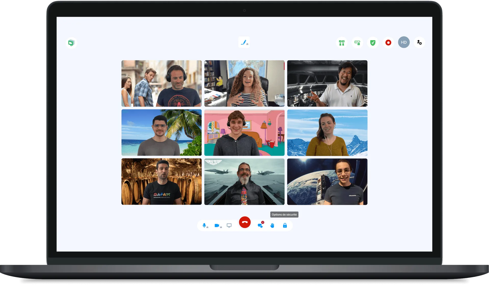
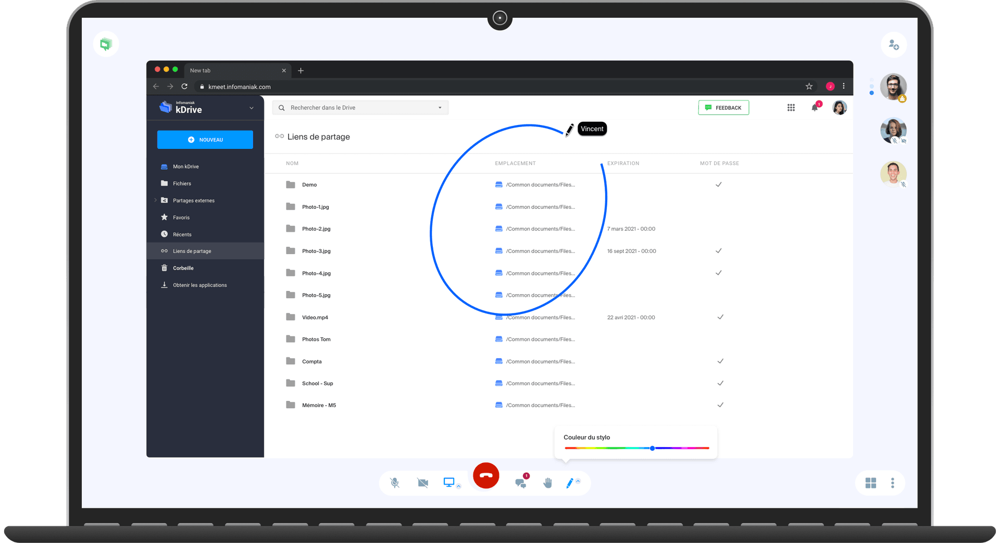
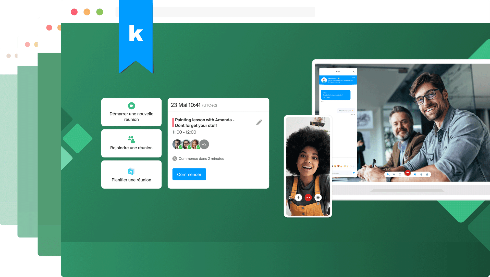
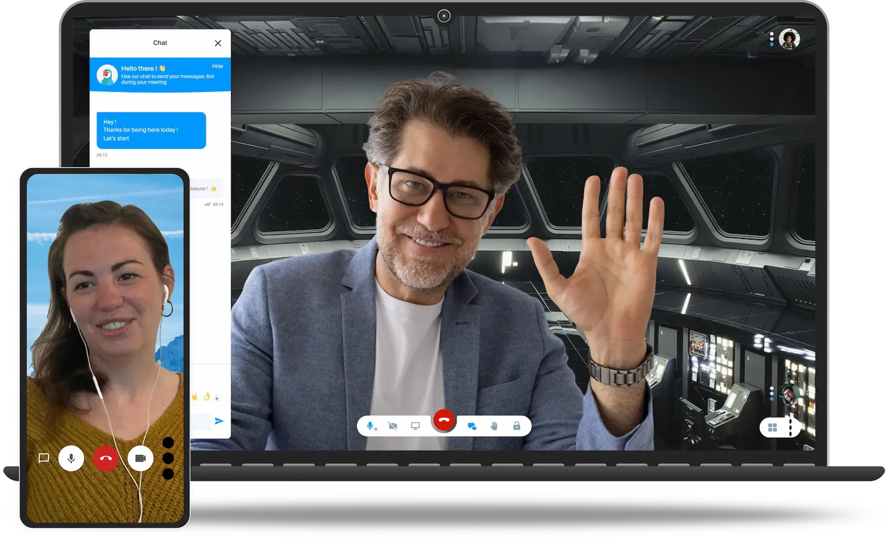

kMeet est la solution de visioconférence d'Infomaniak : **sécurisée, illimitée et gratuite**. Elle permet d'organiser des réunions en ligne et de travailler à distance avec une solution éthique de visioconférence.

## Travaillez à distance comme si vous étiez au bureau

Les fonctionnalités de kMeet s'enrichissent régulièrement pour faciliter vos réunions à distance. kMeet permet de partager la totalité de votre écran, une application ou l'onglet de votre choix, et d'**annoter** directement sur le partage d'écran grâce aux outils de dessin intégrés.

## Atouts principaux

- **Appels audio et vidéo illimités** : aucune limite de durée ni de nombre de réunions.
- **Gratuit** : vous n'êtes pas le produit — aucune publicité, aucune revente de données.
- **Accès sans inscription** : les participants peuvent rejoindre une réunion sans créer de compte.
- **Compatibilité multi-plateformes** : applications de bureau (macOS, Windows, Linux), web, mobile (iOS, Android).
- **Hébergement en Suisse** : les flux transitent par les serveurs Infomaniak en Suisse.
- **Écoresponsable** : énergie renouvelable, compensation CO₂.

## Sécurisé par défaut pour tout le monde

- Protégez l'accès à vos réunions avec un **mot de passe**.
- Parlez librement, vos échanges transitent uniquement par les serveurs d'Infomaniak **en Suisse**.
- Choisissez votre propre **clé de chiffrement**. Par défaut, tous les échanges sont automatiquement chiffrés (AES-256) par les serveurs Infomaniak.
- **Salle d'attente** pour contrôler qui peut accéder à vos réunions.

Voir [Sécurité et modération](../securite/) pour les procédures détaillées.

## Fonctionnalités clés

| Fonctionnalité | Description |
|---|---|
| Chat intégré | Messagerie écrite pendant la réunion, avec émojis, réactions visuelles et sondages. |
| Partage d'écran | Partage de l'écran entier ou d'une fenêtre précise, avec outils d'annotation. |
| Dessin collaboratif | Tableau blanc partagé et annotation sur partage d'écran. |
| Contrôle à distance | Prise de contrôle d'un appareil distant lors d'un partage d'écran. |
| Salles annexes | Division d'une réunion en sous-groupes (breakout rooms). |
| Enregistrement | Enregistrement vidéo côté serveur, stocké sur [kDrive](../integrations/). |
| Streaming en direct | Diffusion publique d'une réunion via un flux séparé accessible par URL. |
| Transcription | Sous-titres automatiques en temps réel. |
| Arrière-plans virtuels | Personnalisation de l'arrière-plan de la webcam. |

## Planifiez vos réunions à l'avance

Avec l'intégration **Calendar**, anticipez vos réunions, invitez vos collaborateurs et avez une vue globale de vos prochaines rencontres. Chaque évènement peut générer automatiquement un lien de visioconférence.

Voir [Réunions](../reunions/) et [Intégrations](../integrations/) pour les procédures détaillées.

## Arrière-plans virtuels

Changez d'environnement en un clic. Choisissez parmi des arrière-plans par défaut ou importez les vôtres. Cette fonctionnalité permet de masquer votre arrière-plan réel pendant la réunion.

## Son et vidéo haute définition sur tous vos appareils

- Application kMeet pour [Windows](https://download.storage.infomaniak.com/meet/kmeet-desktop-setup-2.0.1-win.exe), [macOS](https://download.storage.infomaniak.com/meet/kmeet-desktop-2.0.1-mac.dmg) et [Linux](https://download.storage.infomaniak.com/meet/kmeet-desktop-2.0.1-linux-x86_64.AppImage).
- Compatible avec les principaux navigateurs (Chrome, Firefox, Safari, Edge, Opera, Brave).
- Également disponible sur mobile ([iPhone / iPad](https://apps.apple.com/fr/app/infomaniak-meet/id1505940319), [Android](https://play.google.com/store/apps/details?id=com.infomaniak.meet&hl=fr)).

Voir [Plateformes](../plateformes/) pour le tableau de compatibilité détaillé.

## Éthique et souveraineté

kMeet s'inscrit dans la démarche d'Infomaniak en faveur d'un cloud éthique :

- **Aucune publicité** et aucune exploitation publicitaire des données.
- **Respect de la vie privée** : données hébergées en Suisse, sous droit suisse.
- **Souveraineté numérique** : infrastructure indépendante et européenne.
- **Engagement durable** : datacenters alimentés en énergie renouvelable, compensation CO₂.

## Personnalisation avec Custom Brand

Avec l'option **Custom Brand**, vous pouvez personnaliser l'image de marque de kMeet : votre nom de domaine, votre logo, vos couleurs. Lors du partage de documents ou de vidéoconférences, vos clients restent dans votre univers de marque.

kMeet est gratuit et illimité, mais vous n'êtes pas le produit. Pour soutenir un web respectueux de la vie privée, parlez de kMeet à vos contacts et personnalisez vos outils avec [Custom Brand](https://www.infomaniak.com/fr/ksuite/custom-brand).

---

## Sources

- [Page produit kMeet](https://www.infomaniak.com/fr/ksuite/kmeet)
- [Guide de démarrage kMeet — FAQ 2474](https://faq.infomaniak.com/2474)
