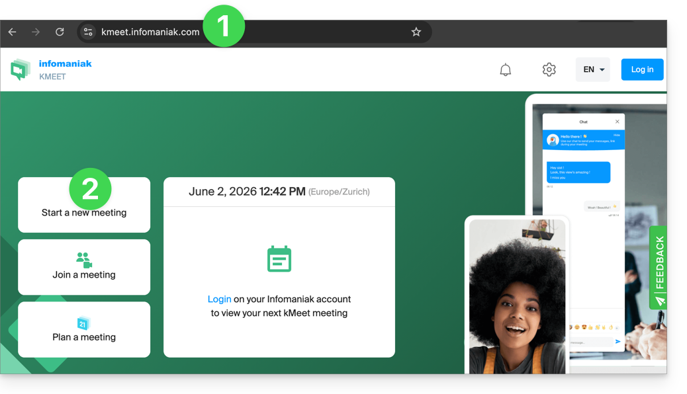
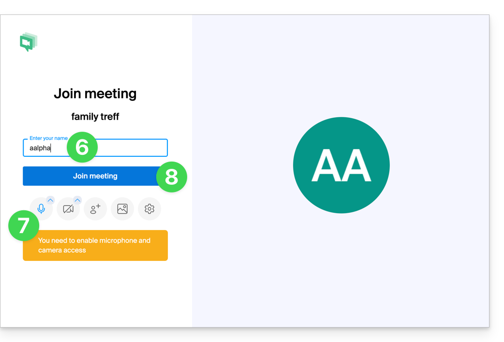
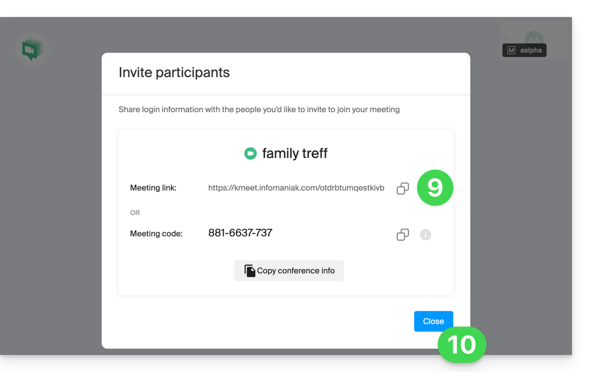

Infomaniak propose de remplacer **Skype** par kMeet et les outils associés, que ce soit pour des appels individuels, des réunions à distance ou des échanges de groupes.

## Pourquoi remplacer Skype par kMeet

Malgré son succès initial, Skype a vu son utilisation diminuer face à l'émergence de solutions mieux intégrées aux nouveaux usages collaboratifs. kMeet offre :

- Appels audio et vidéo **illimités**
- **Accès sans inscription** pour les participants
- Compatibilité **Web, mobile et bureau**
- [Chat intégré](../pendant-reunion/) et réactions
- [Partage d'écran](../pendant-reunion/) avec outils de dessin et prise de contrôle
- [Salles annexes](../reunions/) (breakout rooms)
- Intégration avec [l'agenda](../integrations/), [kDrive](../integrations/) et [kChat](../integrations/)
- **Respect de la vie privée** (aucune publicité, hébergement en Suisse)
- [Chiffrement](../securite/) AES-256
- **Écoresponsable** (énergie renouvelable, compensation CO₂)

## Trois approches pour remplacer Skype

### 1. Utilisation rapide sans inscription

Pour démarrer une communication privée entre plusieurs personnes sur Internet, il suffit que l'une d'entre elles se rende sur kMeet puis communique le lien de la réunion aux autres.

1. Entrez [kmeet.infomaniak.com](https://kmeet.infomaniak.com) sur un navigateur (Chrome, Safari, etc.).
2. Cliquez sur **Démarrer une nouvelle réunion**.

    

3. Entrez un **nom** pour la réunion (indique aux participants le sujet de la discussion).
4. Cliquez sur **Continuer**.
5. Accordez les droits nécessaires à kMeet (caméra, micro).
6. Entrez votre **nom** (celui que verront les autres participants).
7. Activez ou désactivez les moyens de communication si nécessaire.
8. Cliquez sur le bouton pour **rejoindre la salle de réunion**.

    

9. Le salon est créé : **copiez les informations** de la session et **envoyez-les** aux correspondants (ils n'auront qu'à ouvrir le lien).

    

10. Fermez la fenêtre d'information pour converser tous ensemble.

Pour découvrir toutes les possibilités de kMeet, consultez le [Démarrage](../demarrage/).

### 2. Planification et invitations avec my kSuite

Pour travailler efficacement, kMeet peut être **relié directement à votre agenda professionnel**. Chaque évènement génère automatiquement un lien de visioconférence, les participants reçoivent l'invitation par mail et, le jour J, ils rejoignent la réunion en un clic — sans inscription ni logiciel à installer.

**Avantage** : vous centralisez la gestion des réunions, réduisez les oublis et simplifiez l'organisation depuis une seule interface.

Pour mettre en place cette solution :

1. [Inscrivez-vous gratuitement à **my kSuite**](https://www.infomaniak.com/fr/ksuite/myksuite) pour disposer d'une adresse mail (par ex. `anna.alpha@ikmail.com`) et d'un accès aux services Infomaniak.
2. Connectez-vous au calendrier [ksuite.infomaniak.com/calendar](https://ksuite.infomaniak.com/calendar) puis [créez un évènement](../integrations/) le jour de votre choix.
3. Ajoutez des **participants** à l'évènement, même s'ils ne sont pas clients Infomaniak.
4. Cliquez sur le bouton vert pour **générer automatiquement un lien kMeet**.
5. Cliquez sur **sauvegarder** l'évènement.
6. Répondez par **OUI** à la proposition d'envoyer des notifications aux invités.
7. Les invitations sont envoyées automatiquement par mail, contenant le lien kMeet cliquable.
8. Le lien est également visible sur l'évènement dans le calendrier.

### 3. Appeler son correspondant à la manière de Skype

Pour engager une conversation à tout moment avec un contact préalablement enregistré, il est nécessaire que vous possédiez tous les deux **kChat**, disponible au sein de la kSuite Infomaniak. Cette approche s'étend à tout un groupe de contacts.

1. [Inscrivez-vous à **kSuite**](https://www.infomaniak.com/fr/ksuite/ksuite-pro/tarifs) pour disposer d'un accès aux services Infomaniak.
2. Configurez les utilisateurs (ceux-ci peuvent même être externes) sur la kSuite.
3. Installez l'app **kChat** ou rendez-vous sur [ksuite.infomaniak.com/kchat](https://ksuite.infomaniak.com/kchat).
4. Un utilisateur peut ensuite être **appelé via kChat**, ce qui fera sonner l'appareil du destinataire :
    - Navigateur si l'URL kChat y est ouverte, ou ordinateur / appareil mobile si l'app kChat y est installée.
5. Libre à votre correspondant de répondre. L'appel se fait avec la technologie kMeet **au sein de kChat** ou sur l'app **kMeet** si celle-ci est installée.

Pour en savoir plus sur les appels en visioconférence sur kChat, consultez [Intégrations](../integrations/).

---

## Sources

- [Remplacer Skype par Infomaniak — FAQ 2890](https://faq.infomaniak.com/2890)
