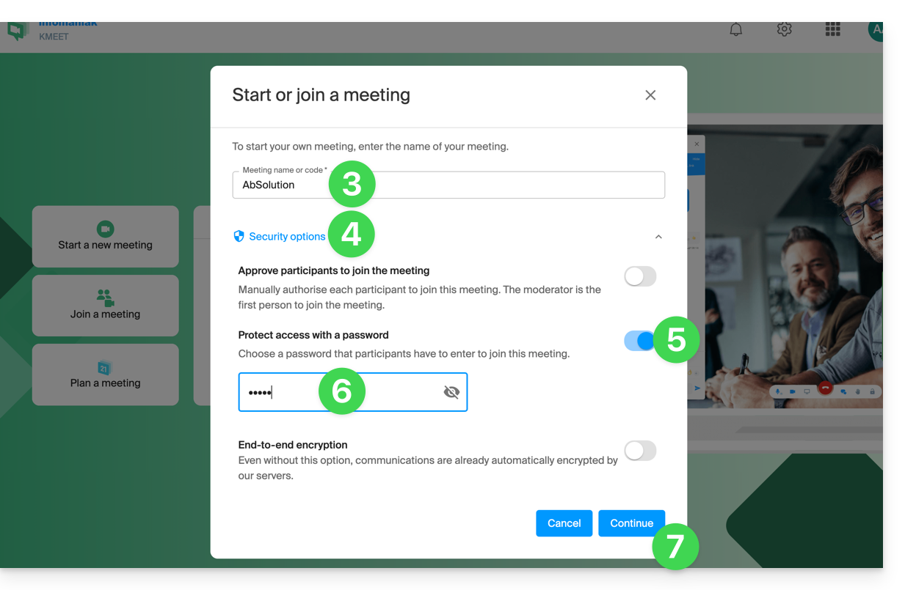
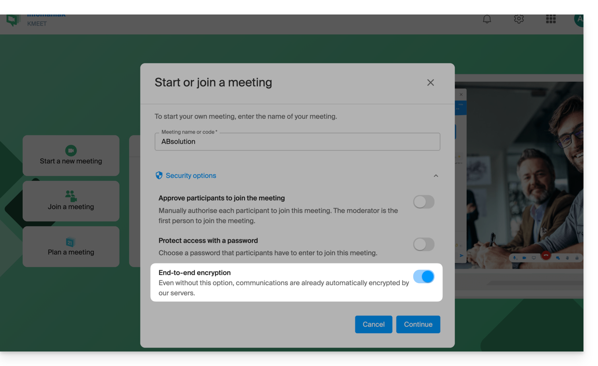
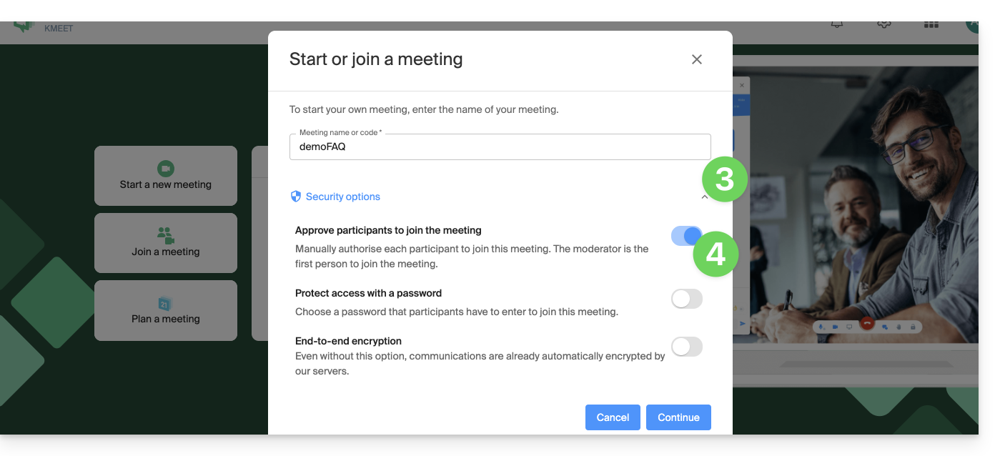
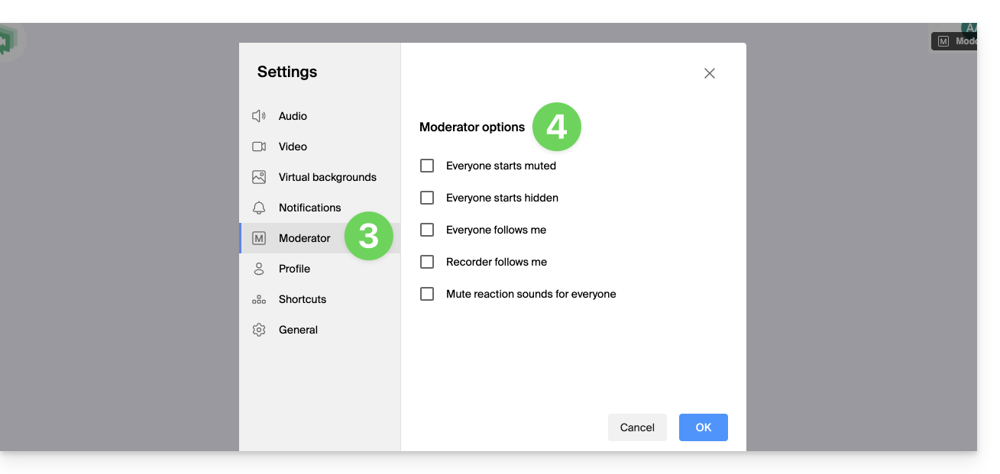

## Protéger une réunion par mot de passe

Vous pouvez protéger l'accès à une réunion par un mot de passe, à transmettre aux participants.

1. Démarrez kMeet et cliquez sur **Démarrer une nouvelle réunion**.
2. Indiquez un **nom** pour votre salle.
3. Cliquez sur les **options de sécurité**.
4. Activez le bouton à bascule pour **Protéger l'accès**.
5. Créez le **mot de passe**.
6. Cliquez sur **Continuer** puis **Démarrez** la réunion.

    

7. Spécifiez le nom que vous voulez utiliser comme participant.
8. Partagez le **lien ou le code de la réunion** ainsi que le **mot de passe** à vos participants.

:::tip[Retrouver le mot de passe]
Vous pouvez réafficher le mot de passe si nécessaire via le bouton dédié à l'invitation des participants.
:::

## Chiffrement de bout en bout (E2E)

Au-delà du chiffrement AES-256 appliqué par défaut par les serveurs Infomaniak, vous pouvez définir **votre propre clé de chiffrement** pour un chiffrement de bout en bout.

:::caution[Prérequis technique]
Le chiffrement E2E fonctionne **uniquement** avec les apps desktop et les navigateurs à jour basés sur l'architecture **Chromium** (Google Chrome, Microsoft Edge, Opera, Brave, etc.).
:::

### Procédure

1. Suivez la procédure de création de réunion jusqu'aux **options de sécurité**.
2. Activez le bouton à bascule pour **chiffrer de bout en bout**.

    

3. Lors du démarrage de la visioconférence, **un message audio** se fait entendre pour annoncer le chiffrement de bout en bout.

:::note[Limites du chiffrement E2E]
- L'[enregistrement sur kDrive](../enregistrement/) **n'est pas compatible** avec le chiffrement E2E.
- Le chiffrement E2E n'est **pas disponible sur mobile** pour le moment.
:::

## Modération des participants

### Être modérateur

- Pour être **modérateur**, il faut soit être **le premier connecté** soit être **désigné par la suite**.
- En général, la personne qui génère le kMeet est le modérateur.
- Si un meeting est créé depuis le [calendrier Infomaniak](../integrations/), le lien kMeet est accessible à tous les participants de l'évènement. Il est donc recommandé à l'initiateur de **se connecter un peu avant** les participants afin de configurer sa réunion (salle d'attente, mot de passe, etc.).

### Activer le contrôle des participants

1. Démarrez kMeet et cliquez pour démarrer une nouvelle réunion.
2. Cliquez sur le **chevron** en dessous du nom de la réunion pour développer les options avancées.
3. Activez le **contrôle des participants** (salle d'attente).

    

4. **Démarrez** la réunion.
5. Partagez le lien/code de la réunion et si nécessaire le mot de passe et/ou la clé de chiffrement.

### Approuver ou refuser les participants

Lorsqu'un participant tente de rejoindre la réunion :

- Une **notification sonore** invite le modérateur à autoriser ou non l'arrivée.
- Le modérateur peut également définir un participant comme **nouveau modérateur** ou l'**exclure** de la réunion via le menu d'action à droite dans la liste.

### Désactiver la salle d'attente en cours de réunion

1. Cliquez sur l'icône **○○○** dans la barre d'outils.
2. Cliquez sur **Options de sécurité**.
3. Désactivez l'option pour ne plus gérer les nouvelles arrivées.

### Options de modération avancées

Accédez à **Paramètres** > **Modération** via le menu **○○○** :

    

| Option | Effet |
|---|---|
| Micros coupés au démarrage | Tous les participants démarrent avec le micro coupé. |
| Caméras coupées au démarrage | Tous les participants démarrent avec la caméra coupée. |
| Affichage identique au modérateur | L'interface des participants suit celle du modérateur (participant affiché en grand, etc.). Modifiable par les utilisateurs, mais le modérateur peut forcer la mise à jour à tout moment. |
| Enregistrement selon affichage modérateur | L'[enregistrement](../enregistrement/) utilise l'affichage identique à celui du modérateur. |
| Réactions sans son | Les émojis de réaction ne provoquent aucun son. |

---

## Sources

- [Sécuriser une réunion kMeet par mot de passe et clé de chiffrement — FAQ 2464](https://faq.infomaniak.com/2464)
- [Gérer les participants kMeet — FAQ 2476](https://faq.infomaniak.com/2476)
