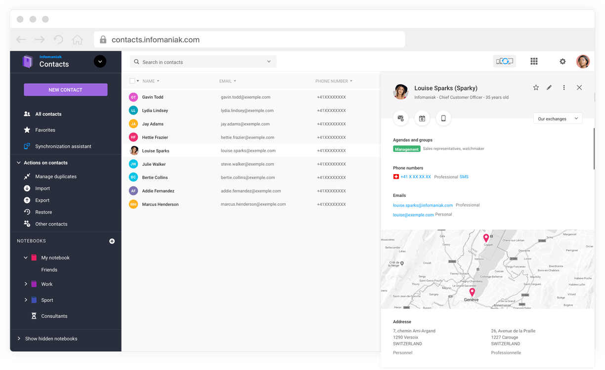
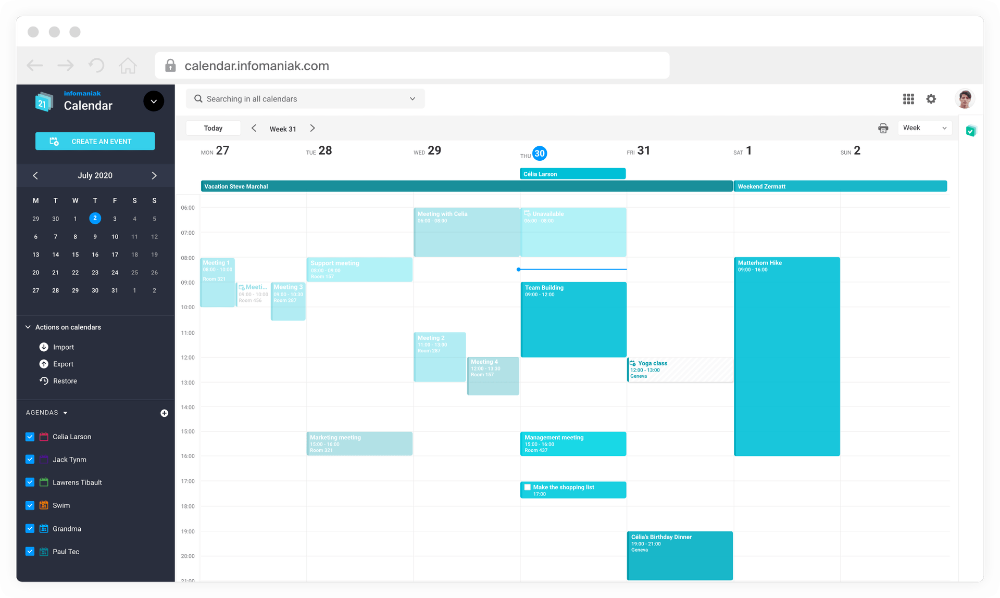

Ce guide explique comment gérer vos contacts et calendriers, les synchroniser sur vos appareils et les partager avec vos collaborateurs.

## Contacts

### Accéder aux contacts

1. Ouvrez le webmail sur [ksuite.infomaniak.com/mail](https://ksuite.infomaniak.com/mail).
2. Cliquez sur l'icône **Contacts** dans la barre latérale.

### Fonctionnalités

- **Centralisez vos contacts** : tous vos contacts au même endroit, pour l'ensemble de vos équipes.
- **Gestion des doublons** : Infomaniak Contacts gère les doublons entre utilisateurs partagés et ne garde qu'une seule version d'un contact.
- **Import / export** : importez vos contacts depuis un fichier VCARD ou CSV, exportez votre liste rapidement.

### Importer des contacts

1. Dans l'app Contacts, cliquez sur **Importer**.
2. Sélectionnez un fichier au format **VCARD** ou **CSV**.
3. Choisissez le carnet d'adresses de destination.
4. Cliquez sur **Importer**.

### Partager un carnet d'adresses

1. Dans l'app Contacts, cliquez sur le carnet d'adresses à partager.
2. Cliquez sur **Partager**.
3. Ajoutez les utilisateurs ou groupes avec qui partager.
4. Définissez le niveau de permission (lecture ou modification).

### Synchroniser les contacts (CardDAV)

Infomaniak utilise le protocole **CardDAV** pour synchroniser vos contacts sur tous vos appareils :

1. Rendez-vous sur [config.infomaniak.com](https://config.infomaniak.com).
2. Sélectionnez votre appareil.
3. Suivez les instructions pour configurer CardDAV.

| Paramètre | Valeur |
|---|---|
| Serveur CardDAV | `contacts.infomaniak.com` |
| Port | 443 (SSL) |
| Utilisateur | Votre adresse mail complète |
| Mot de passe | Votre mot de passe d'appareil |

## Calendar

### Accéder au calendrier

1. Ouvrez le webmail sur [ksuite.infomaniak.com/mail](https://ksuite.infomaniak.com/mail).
2. Cliquez sur l'icône **Calendar** dans la barre latérale.

### Fonctionnalités

- **Planifiez et organisez vos réunions** : vérifiez les disponibilités de vos collègues en affichant tous leurs agendas sur un même écran.
- **Partagez, consultez et acceptez** : acceptez ou déclinez rapidement vos invitations dans une interface simple et conçue pour l'efficacité.
- **Intégration avec Mail** : l'intégration parfaite avec Mail assure de ne jamais manquer un événement.
- **Import / export** : importez vos rendez-vous depuis un fichier ICS, exportez vos événements vers d'autres calendriers.

### Créer un évènement

1. Dans l'app Calendar, cliquez sur la date et l'heure souhaitées.
2. Saisissez le titre de l'évènement.
3. Ajoutez les invités (par adresse e-mail).
4. Définissez le lieu, la description et les rappels.
5. Ajoutez des pièces jointes depuis kDrive si nécessaire.
6. Cliquez sur **Enregistrer**.

### Partager un calendrier

1. Dans l'app Calendar, cliquez sur le calendrier à partager.
2. Cliquez sur **Partager**.
3. Ajoutez les utilisateurs ou groupes.
4. Définissez le niveau de permission (consulter, modifier, gérer).

### Synchroniser le calendrier (CalDAV)

Infomaniak utilise le protocole **CalDAV** pour synchroniser vos calendriers :

1. Rendez-vous sur [config.infomaniak.com](https://config.infomaniak.com).
2. Sélectionnez votre appareil.
3. Suivez les instructions pour configurer CalDAV.

| Paramètre | Valeur |
|---|---|
| Serveur CalDAV | `calendar.infomaniak.com` |
| Port | 443 (SSL) |
| Utilisateur | Votre adresse mail complète |
| Mot de passe | Votre mot de passe d'appareil |

### Importer un calendrier

1. Dans l'app Calendar, cliquez sur **Importer**.
2. Sélectionnez un fichier au format **ICS**.
3. Choisissez le calendrier de destination.
4. Cliquez sur **Importer**.

---

## Sources

- [Page écosystème Service Mail](https://www.infomaniak.com/fr/ksuite/service-mail/ecosysteme)
- [Page produit Service Mail](https://www.infomaniak.com/fr/ksuite/service-mail)
- [Assistant de configuration](https://config.infomaniak.com)
