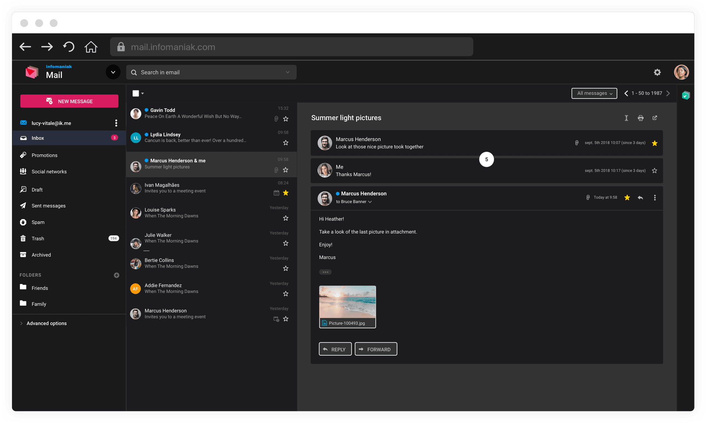

import { Tabs, TabItem } from '@astrojs/starlight/components';

Ce guide explique comment accéder à Service Mail, configurer vos adresses et synchroniser vos appareils.

## Obtenir Service Mail

Service Mail est accessible selon plusieurs formules :

| Offre | Accès |
|---|---|
| my kSuite (gratuit) | 1 adresse mail gratuite avec 20 Go de stockage |
| Service Mail | Abonnement indépendant avec nom de domaine personnalisé |
| kSuite Standard / Business / Enterprise | Adresses mail incluses avec kDrive, kChat, kMeet |

:::tip
Pour créer une adresse mail gratuite, créez un compte my kSuite sur [welcome.infomaniak.com](https://welcome.infomaniak.com/signup).
:::

## Accéder au webmail

L'app Web Mail Infomaniak permet de gérer vos e-mails, contacts et calendriers sans installer de logiciel :

1. Rendez-vous sur [ksuite.infomaniak.com/mail](https://ksuite.infomaniak.com/mail).
2. Connectez-vous avec votre compte Infomaniak.
3. L'interface Mail s'affiche avec votre boîte de réception, vos dossiers et vos outils.

Depuis le webmail, vous pouvez :
- Lire, rédiger et envoyer des e-mails.
- Gérer vos contacts et calendriers.
- Activer le chiffrement des e-mails.
- Configurer des filtres et règles de tri.
- Utiliser l'IA souveraine pour rédiger et traduire.

## Configurer une adresse mail

### Créer une adresse mail

1. Accédez à la [gestion de votre Service Mail](https://manager.infomaniak.com/v3/ng/products/ksuite/service-mail) sur le Manager Infomaniak.
2. Cliquez sur le nom attribué au Service Mail concerné.
3. Cliquez sur **Ajouter une adresse mail**.
4. Saisissez le nom de l'adresse et sélectionnez le domaine.
5. Définissez un mot de passe ou invitez l'utilisateur.
6. Cliquez sur **Créer**.

:::note
Pour les offres payantes, vous pouvez créer des adresses avec votre nom de domaine personnalisé (ex : manon@votre-entreprise.com).
:::

### Configurer la synchronisation

Infomaniak propose un assistant de configuration pour synchroniser vos e-mails, contacts et calendriers sur tous vos appareils :

1. Rendez-vous sur [config.infomaniak.com](https://config.infomaniak.com).
2. Sélectionnez votre appareil (Windows, macOS, Linux, iOS, Android).
3. Suivez les instructions étape par étape.

## Utiliser avec un logiciel de messagerie

Vos adresses Infomaniak sont compatibles avec tous les logiciels supportant IMAP/POP/SMTP :

| Paramètre | Valeur |
|---|---|
| Serveur IMAP | `mail.infomaniak.com` (port 993, SSL) |
| Serveur POP | `mail.infomaniak.com` (port 995, SSL) |
| Serveur SMTP | `mail.infomaniak.com` (port 465, SSL) |
| Nom d'utilisateur | Votre adresse mail complète |
| Mot de passe | Votre mot de passe d'appareil |

:::note[Mot de passe d'appareil]
Pour configurer un logiciel de messagerie, vous devez créer un **mot de passe d'appareil** distinct du mot de passe de votre compte Infomaniak. Créez-le depuis le Manager : gestion de l'adresse mail > Mot de passe d'appareil.
:::

<Tabs>
  <TabItem label="Outlook">
    1. Ouvrez Outlook > **Fichier** > **Ajouter un compte**.
    2. Saisissez votre adresse mail Infomaniak.
    3. Choisissez **IMAP** comme type de compte.
    4. Saisissez les paramètres IMAP et SMTP ci-dessus.
    5. Utilisez votre mot de passe d'appareil.
  </TabItem>
  <TabItem label="Thunderbird">
    1. Ouvrez Thunderbird > **Paramètres des comptes** > **Ajouter un compte mail**.
    2. Saisissez votre nom, votre adresse mail et votre mot de passe d'appareil.
    3. Thunderbird détecte automatiquement les paramètres IMAP/SMTP Infomaniak.
  </TabItem>
  <TabItem label="Apple Mail">
    1. Ouvrez **Mail** > **Réglages** > **Comptes** > **Ajouter un compte**.
    2. Choisissez **Autre compte mail**.
    3. Saisissez votre adresse mail et votre mot de passe d'appareil.
    4. Apple Mail configure automatiquement les paramètres IMAP/SMTP.
  </TabItem>
</Tabs>

## Installer l'app mobile

L'app mobile Infomaniak Mail est disponible sur iOS et Android :

- **iOS** : [App Store](https://apps.apple.com/app/infomaniak-mail/id1542601761)
- **Android** : [Google Play](https://play.google.com/store/apps/details?id=com.infomaniak.mail)

Depuis votre mobile, vous pouvez :
- Consulter et envoyer des e-mails.
- Gérer vos contacts et calendriers.
- Activer le chiffrement des e-mails.
- Recevoir des notifications push.

## Personnaliser l'affichage

Le webmail Infomaniak s'adapte à vos préférences :

- **Densité d'affichage** : mode large, medium ou compact.
- **Thème** : clair, sombre ou automatique (basé sur votre système).
- **Mode nuit** : bascule entre le jour et la nuit selon vos préférences.

## Premiers pas

Une fois votre messagerie configurée, explorez les actions essentielles :

- [Envoyer et recevoir des e-mails](../messagerie/)
- [Sécuriser votre messagerie](../securite/)
- [Gérer contacts et calendriers](../contacts-calendar/)
- [Utiliser l'IA souveraine](../ia/)
- [Découvrir l'écosystème kSuite](../ecosysteme/)
- [Administrer les utilisateurs](../administration/)
- [Migrer depuis un autre fournisseur](../migration/)

---

## Sources

- [Page produit Service Mail](https://www.infomaniak.com/fr/ksuite/service-mail)
- [Page caractéristiques](https://www.infomaniak.com/fr/ksuite/service-mail/caracteristiques)
- [Assistant de configuration](https://config.infomaniak.com)
