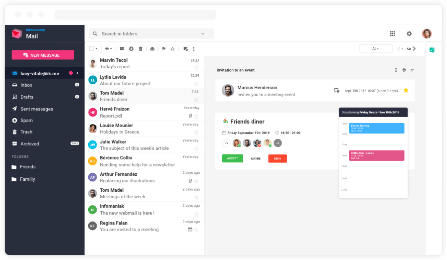
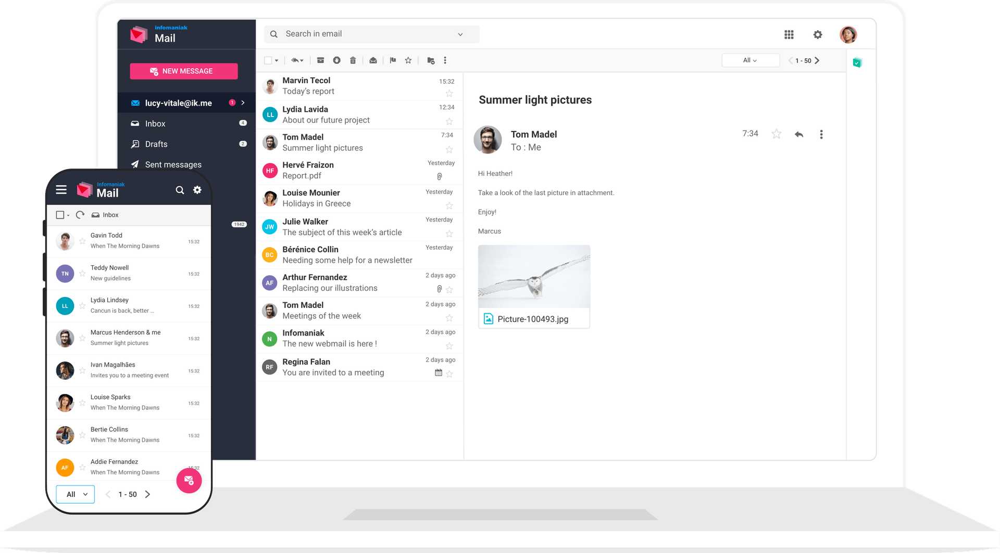
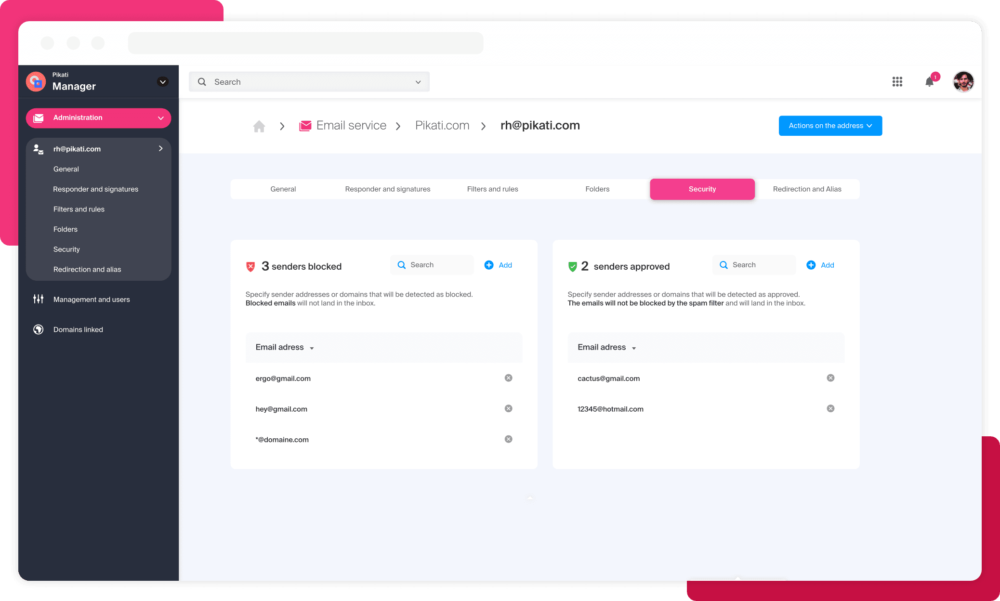
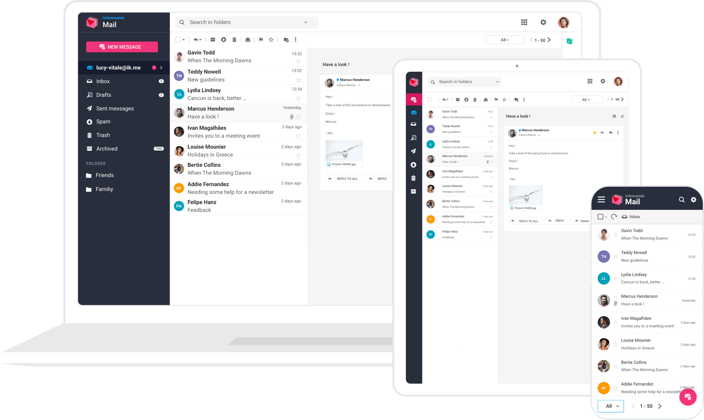

Service Mail s'intègre parfaitement à kSuite, un écosystème de produits interconnectés pour une expérience de travail complète et performante.

## Produits inclus avec Service Mail

### Mail

Le webmail respectueux de votre vie privée, géré et hébergé en Suisse dans des datacenters écologiques.

### Calendar

N'oubliez plus aucun évènement. Notre calendrier intelligent est conçu pour vous faire gagner du temps :

- Vérifiez les disponibilités de vos collègues en affichant tous leurs agendas sur un même écran.
- Acceptez ou déclinez rapidement vos invitations.
- Intégration parfaite avec Mail.
- Importez et exportez vos évènements (ICS).

Voir [Contacts et calendrier](../contacts-calendar/).

### Contacts

Centralisez, partagez et synchronisez vos contacts :

- L'ensemble de vos contacts au même endroit, pour l'ensemble de vos équipes.
- Gestion automatique des doublons.
- Import / export en un claquement de doigts.

Voir [Contacts et calendrier](../contacts-calendar/).

## Produits interconnectés

Tous les produits kSuite sont reliés entre eux de manière intuitive :

### kDrive (en option)

Synchronisez, collaborez et partagez vos fichiers. Découvrez la collaboration en direct pour travailler à plusieurs sur un même fichier Word, Excel, PowerPoint.

- Envoyez des pièces jointes jusqu'à 3 Go directement depuis votre kDrive.
- Exportez vos e-mails vers kDrive au format `.eml`.

Voir la [documentation kDrive](../../kdrive/).

### kMeet (inclus)

Passez à une solution de visioconférence sécurisée qui vous suit partout et qui respecte votre vie privée.

- Démarrez une visioconférence kMeet directement depuis un e-mail.

Voir la [documentation kMeet](../../kmeet/).

### SwissTransfer (inclus)

Transférez des fichiers volumineux jusqu'à 50 Go gratuitement. Obtenez un lien pour partager sur vos applications préférées ou envoyez par mail.

Voir [SwissTransfer](https://www.swisstransfer.com/).

## Gestion des utilisateurs

Notre messagerie est conçue pour les professionnels : tout est mis en œuvre pour augmenter votre productivité et simplifier la gestion de vos collaborateurs.

Voir [Administration](../administration/) pour la gestion des utilisateurs et des accès.

## Multi-appareils

L'ensemble des produits d'Infomaniak Mail sont conçus pour être utilisés sur un maximum d'appareils :

- **Web** : interface en ligne optimisée pour tous les écrans.
- **Mobile** : apps iOS et Android.
- **Desktop** : compatible avec Outlook, Thunderbird, Apple Mail via IMAP/SMTP.
- **CardDAV / CalDAV** : synchronisation des contacts et calendriers.

## Personnalisation

Adaptez les interfaces de vos produits selon vos préférences :

- **Densité d'affichage** : large, medium ou compact.
- **Thème** : clair, sombre ou automatique.

---

## Sources

- [Page écosystème Service Mail](https://www.infomaniak.com/fr/ksuite/service-mail/ecosysteme)
- [Page produit Service Mail](https://www.infomaniak.com/fr/ksuite/service-mail)
