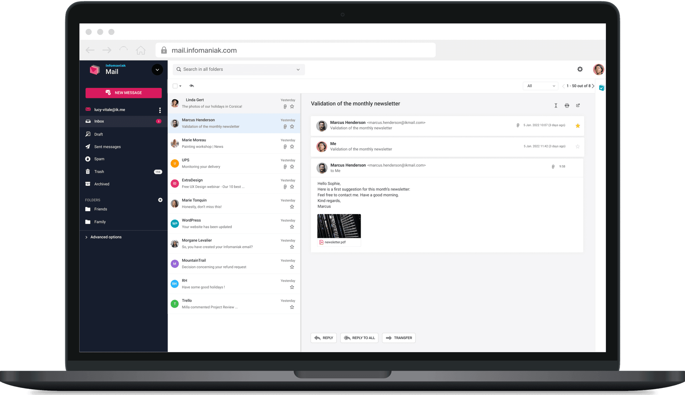

Service Mail est la messagerie sécurisée d'Infomaniak : **souveraine, éthique et parfaitement intégrée à kSuite**. Gérez vos e-mails, contacts et calendriers en Suisse avec un service mail qui respecte votre vie privée.

## Atouts principaux

- **Messagerie souveraine** : développée et hébergée exclusivement en Suisse.
- **Stockage illimité** : conservez tous vos e-mails sans contrainte d'espace.
- **Sécurité par défaut** : chiffrement en 1 clic, anti-spam, anti-virus, SPF/DKIM/DMARC.
- **Nom de domaine personnalisé** : créez des adresses avec votre domaine (ex : manon@votre-entreprise.com).
- **IA souveraine intégrée** : rédigez, traduisez et corrigez vos e-mails avec une IA hébergée en Suisse.
- **Écosystème kSuite** : Mail, Calendar, Contacts, kDrive, kMeet interconnectés.
- **Multiplateforme** : web, desktop, mobile, et compatible IMAP/POP/SMTP avec tous les logiciels.
- **Aucune publicité** : vos e-mails ne sont jamais analysés ou revendus.

## Un acteur suisse reconnu

- **+30 ans** d'expérience depuis la création d'Infomaniak.
- **+3 millions** d'adresses mail hébergées.
- Entreprise suisse indépendante, détenue par ses fondateurs et ses employés.

## Sécurité par conception

Service Mail intègre la sécurité à tous les niveaux :

- **Chiffrement des e-mails en 1 clic** : protégez vos messages contre toute interception. Les e-mails chiffrés ne sont lisibles que depuis votre compte, dans un environnement sécurisé par Infomaniak.
- **Conforme à la LPD et à la LDEP** pour la transmission sécurisée de données sensibles.
- **Fonctionne avec tous les fournisseurs** de messagerie.
- **Standards open source** : ECC et OpenPGP.
- **Anti-spam et anti-virus** : Infomaniak bloque plus de 99,9% des spams, logiciels malveillants et attaques d'hameçonnage.
- **SPF, DKIM et DMARC** activés par défaut pour protéger contre l'usurpation d'identité.
- **Backup quotidien** : boîtes mail sauvegardées quotidiennement sur plusieurs serveurs en Suisse, restauration sous 30 jours.
- **Disponibilité 99,99%** : système de secours automatique en cas de panne.

Voir [Sécurité](../securite/) pour les procédures détaillées.

## Adresse mail personnalisée

Renforcez la confiance de vos clients en octroyant à chacun de vos collaborateurs un e-mail professionnel incluant votre nom de domaine, exemple : manon@votre-entreprise.com.

## Fonctionnalités clés

| Fonctionnalité | Description |
|---|---|
| Stockage illimité | Aucune limite pour conserver vos e-mails. |
| Pièces jointes | Jusqu'à 200 Mo en SMTP, 3 Go via le webmail, 50 Go via SwissTransfer. |
| Alias et catégories | Créez des variantes de votre adresse (alias) et triez avec des catégories (+travail, +formation). |
| Redirection | Transférez ou copiez vos e-mails vers une ou plusieurs adresses. |
| Répondeur automatique | Message d'absence programmable, avec modèles partagés. |
| Signatures personnalisées | Créez des modèles de signatures pour toute l'organisation. |
| Filtres et règles | Filtrez les messages entrants par expéditeur, sujet, etc. |
| Filtre anti-spam | Dossier Spam automatique, messages effacés après 30 jours. |
| Filtre publicitaire | Newsletters et notifications classées automatiquement. |
| Dossiers IMAP | Personnalisez les dossiers visibles dans vos logiciels. |
| Protocoles | IMAP, POP, SMTP, CalDAV, CardDAV. |
| SSO | Authentification unique pour les entreprises. |

## Personnalisation avec Custom Brand

Avec l'option **Custom Brand**, personnalisez votre messagerie avec votre logo, vos couleurs et votre nom de domaine. Vos clients sont toujours dans votre univers de marque.

## Offres Service Mail

| Offre | Adresses mail | Stockage | Public |
|---|---|---|---|
| **my kSuite** | 1 adresse gratuite | 20 Go | Particuliers |
| **Service Mail** | Dès 1 adresse | Illimité | Indépendants |
| **kSuite Standard** | 2 adresses par utilisateur | Illimité | Petites équipes |
| **kSuite Business** | 5 adresses par utilisateur | Illimité | PME |
| **kSuite Enterprise** | 10 adresses par utilisateur | Illimité + Custom Brand | Grandes organisations |

:::tip
L'adresse mail gratuite (my kSuite) dispose des mêmes niveaux de sécurité et de protection des données qu'une adresse payante. La différence : 20 Go de stockage et 100 e-mails/jour pour l'offre gratuite, contre stockage illimité et 500 e-mails/jour pour les offres payantes.
:::

## Éthique et souveraineté

- **Aucune publicité** et aucune exploitation publicitaire des données.
- **Respect de la vie privée** : données hébergées en Suisse, sous droit suisse (LPD, nLPD).
- **Conforme au RGPD** européen.
- **Souveraineté numérique** : infrastructure indépendante, hors Cloud Act.
- **Engagement durable** : datacenters alimentés en énergie renouvelable, 200% de compensation CO₂.

---

## Sources

- [Page produit Service Mail](https://www.infomaniak.com/fr/ksuite/service-mail)
- [FAQ Service Mail](https://www.infomaniak.com/fr/support/faq/admin2/service-mail)
